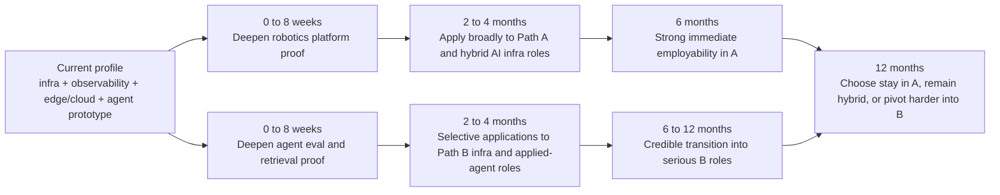

# Candidate Research Report for Platform Engineering in Robotics and Agentic AI Systems

## Executive Summary

Based on the candidate profile provided, the strongest immediate fit is **Platform Engineering in Robotics and adjacent AI infrastructure roles**, not pure-play **Agentic AI Systems Engineering**. The candidate already has verified evidence in distributed systems, Kubernetes and service mesh operations, observability, cloud-edge systems, streaming and eventing, and a meaningful bridge into robotics and agentic tooling through ROS 2, FogROS2, NATS, ClickHouse, and an internal agent/code-generation platform. fileciteturn0file0

The current public market snapshot reinforces that conclusion. Across the job sample reviewed on July 16, 2026, robotics-platform and AI-infrastructure roles repeatedly ask for Kubernetes, cloud infrastructure, IaC, observability, streaming data systems, multi-environment operations, and production reliability. The agentic-AI side is also hiring heavily, but the upper-tier roles tend to require more explicit, externally legible evidence in one or more of the following: LLM evaluation science, retrieval and ranking systems, RAG quality measurement, multi-agent orchestration, model serving, post-training or inference systems, and benchmark-driven validation. citeturn27view0turn29view11turn30view1turn30view2turn30view3turn26view0turn30view10turn30view11turn30view0

My overall assessment is therefore:

| Path | Fit score | Confidence | Short verdict |
|---|---:|---|---|
| **A: Platform Engineering in Robotics** | **79 / 100** | Medium-high | Apply now, especially to robotics data/infra/backend, AI infrastructure, and simulation/tooling roles. |
| **B: Agentic AI Systems Engineering** | **63 / 100** | Medium | Apply selectively now to AI platform / agent infrastructure roles, but build one or two strong portfolio proofs before targeting evaluation-heavy, frontier-agent, or post-training roles. |

The best strategic choice is **not** “A versus B” in isolation. It is **A-first, B-parallel**: use the candidate’s existing credibility to land in platform, AI infrastructure, robotics data, or observability-heavy roles now, while deliberately building a portfolio that converts agentic-AI interest into credible production evidence over the next 6–12 months. That path preserves optionality and compounds strengths already visible in the profile. This is an inference from the candidate’s documented background and the live market snapshot. fileciteturn0file0 citeturn27view0turn30view12turn30view1turn30view2turn29view3turn30view0turn26view0

## Scope and Method

This report uses two evidence streams. First, I used the candidate profile you supplied as the source of truth for background, skills, projects, and outcomes. Second, I reviewed a current public market sample of active job descriptions and official technical documentation for the main platforms, frameworks, and learning resources relevant to both target paths. fileciteturn0file0 citeturn20view0turn20view1turn20view2turn21view0turn21view1turn21view2turn21view3turn20view3turn34view0turn40view1turn42view0turn40view2

A methodological caveat matters: I was able to verify that the job pages were public and active when accessed, but many ATS pages did **not** expose machine-readable posting dates in the parsed text. So this is best treated as a **current market snapshot**, not a strictly date-verified “all postings were published within the last 180 days” sample. Where that uncertainty exists, I say so explicitly instead of guessing.

### Current role sample reviewed

The table below lists the public role pages I reviewed. Citations in the final column open the source page directly.

| Company | Role | Primary signal | Family | Source |
|---|---|---|---|---|
| Anthropic | Research Engineer, Model Evaluations | Model evals, dashboards, distributed eval platform, observability | B | citeturn26view0 |
| Anthropic | Research Engineer, Production Model Post-Training | RLHF / alignment / post-training / incident response | B | citeturn30view6 |
| Scale AI | Infrastructure Software Engineer, Enterprise GenAI | Multi-cloud infra, enterprise integrations, K8s, Python/TS, SQL | Hybrid A/B | citeturn29view11 |
| Scale AI | Staff Infrastructure Software Engineer, Enterprise AI | IaC, Helm, Kubernetes, observability, compliance, agentic workflows | Hybrid A/B | citeturn27view0 |
| Scale AI | Software Engineer, Platform | Distributed systems, reliable backend services, LLM and vector integrations | Hybrid A/B | citeturn30view12 |
| Scale AI | Software Engineer, Enterprise AI | Full-stack plus LLM/ML interaction, K8s, cloud | Hybrid A/B | citeturn30view5 |
| Scale AI | Machine Learning Engineer, Platform | RAG pipelines, vector stores, retrieval, knowledge graphs | B | citeturn30view10 |
| Scale AI | Machine Learning Systems Research Engineer, Agent Post-training | Training/inference frameworks, RLHF, GPU cluster know-how | B | citeturn30view11 |
| Scale AI | Frontier Agents Engineer | Customer-facing production AI systems, custom AI architecture | B | citeturn30view4 |
| Figure | Helix AI Engineer, Agentic Systems | Multimodal agents, episodic memory, long-horizon planning | B | citeturn30view0turn29view13 |
| Figure | Helix AI Engineer, Backend Infrastructure | High-throughput streaming, low-latency backends, cloud infra | A | citeturn30view1 |
| Figure | Helix AI Engineer, Data Infrastructure | Robot data pipelines, storage, on-prem/cloud resources, prod support | A | citeturn30view2 |
| Figure | Helix AI Engineer, Training Infrastructure | Training clusters, distributed training, data loaders, researcher tools | Hybrid A/B | citeturn30view3 |
| Skydio | Autonomy Engineer, Deep Learning Infrastructure | Inference optimization, MLOps, deployment, monitoring | A | citeturn30view7turn29view1 |
| Skydio | Autonomy Simulation & Tools Engineer | Simulation tooling, telemetry, log pipelines, visualization | A | citeturn29view3 |
| Skydio | Autonomous Systems Data Mining Engineer | Telemetry, logs, data discovery, anomaly surfacing | A | citeturn30view9 |
| Skydio | Autonomy Software Engineer | Robotics algorithms, resilience, test infrastructure, cross-stack work | A | citeturn30view8 |

### What the market is actually signaling

Across this live sample, the recurring capability clusters are not random. They sort into a few stable buckets.

| Capability cluster | What recurs in the postings | Stronger for A or B | Representative evidence |
|---|---|---|---|
| Cloud + Kubernetes + multi-environment operations | Kubernetes, major cloud providers, multi-cloud deployments, secure isolation, customer/VPC setups | A and Hybrid | citeturn27view0turn29view11turn30view12 |
| IaC + deployment packaging | Terraform / OpenTofu analogs, Helm, deployment standards, CI/CD | A and Hybrid | citeturn27view0turn21view1turn46view1 |
| Observability + reliability | Logging, metrics, tracing, dashboards, incident response, monitoring | A and Hybrid, but also Anthropic eval infra | citeturn27view0turn26view0turn36view0turn36view1 |
| Streaming + telemetry + data pipelines | Sensor/media streams, robot logs, telemetry, queryable data architectures | A | citeturn30view1turn30view2turn29view3turn30view9turn22view0turn36view2 |
| ML infrastructure + serving | Training clusters, inference pipelines, MLOps, deployment, monitoring | A and Hybrid | citeturn30view3turn30view7turn41view4turn41view0 |
| Agentic orchestration + stateful execution | Long-running agents, HITL, persistence, orchestration runtimes, tool use | B | citeturn20view0turn33view5turn33view7turn20view1turn34view1 |
| Retrieval + RAG + vector infrastructure | Vector stores, indexing, reranking, context engines, enterprise data connectors | B | citeturn30view10turn29view12turn37academia3turn37academia1turn38academia3 |
| Evals + benchmarked quality measurement | Model evaluations, benchmark harnesses, dashboards, regression detection | B | citeturn26view0turn47view0turn47view2 |
| Deep robotics context | ROS 2 adjacent thinking, simulation, embodied autonomy, sensor pipelines, field resilience | A | citeturn30view0turn30view1turn29view3turn30view8turn39academia0turn39academia1 |

The practical interpretation is simple. **Path A** rewards the candidate’s existing profile more directly because it heavily overlaps with infrastructure, telemetry, reliability, and edge/cloud platform work already documented in the profile. **Path B** is viable, but the market increasingly asks for visible artifacts that go beyond “I have used LLMs” and into “I can design, measure, debug, and productionize agent systems.” That latter evidence is only partly present today. fileciteturn0file0 citeturn26view0turn27view0turn30view1turn30view10turn30view11

## Fit for Platform Engineering in Robotics

### What Path A means in practice

For this report, **Platform Engineering in Robotics** means roles that sit between robotics product teams and the infrastructure required to support them. That includes cloud-edge connectivity, observability, fleet telemetry, data ingestion, replay and simulation tools, model serving, cluster operations, deployment workflows, storage and streaming, and the platform abstractions that let robotics or autonomy teams move faster without repeatedly rebuilding internal systems. That interpretation aligns with the Figure, Skydio, and adjacent AI infrastructure roles reviewed here. citeturn30view1turn30view2turn30view3turn29view3turn30view9turn30view8

### Competency map for Path A

The table below classifies the main skill areas the market is rewarding for this path and maps them against the candidate’s current signal.

| Capability area | Priority | Expected depth | Candidate signal today | Assessment |
|---|---|---|---|---|
| Kubernetes platform operations | P0 | Production fluency | Strong Kubernetes and service-mesh operational background. fileciteturn0file0 | Strong |
| Observability stack design | P0 | Production fluency | OpenTelemetry, Tempo/Loki/Grafana, ClickHouse observability migrations, incident posture. fileciteturn0file0 | Strong |
| Distributed systems and backend reliability | P0 | Production fluency | Go/C++/Python systems background, distributed services, scale and latency outcomes. fileciteturn0file0 | Strong |
| Streaming and eventing | P0 | Production fluency | NATS, event-driven systems, telemetry-style architecture exposure. fileciteturn0file0 | Strong |
| Cloud + edge systems | P0 | Production fluency | Edge/cloud robotics and infrastructure experience already visible. fileciteturn0file0 | Strong |
| IaC and deployment packaging | P1 | Hands-on production fluency | Kubernetes depth is strong; Terraform/OpenTofu/Helm are credible but need cleaner public proof. fileciteturn0file0 | Medium |
| Robotics telemetry and data-plane tooling | P1 | Project-to-production | Good adjacent evidence, especially robotics/edge context and observability, but more explicit robot-fleet telemetry products would help. fileciteturn0file0 | Medium |
| ROS 2 and robotics middleware | P1 | Working fluency | ROS 2/FogROS2 exposure is present, but not yet the centerpiece of the profile. fileciteturn0file0 | Medium |
| ML infra / model deployment | P1 | Working fluency | Some bridge evidence exists, but stronger public serving/training examples would help. fileciteturn0file0 | Medium |
| C++ in robotics systems | P2 | Comfortable contributor | C++ exists in background, but not clearly foregrounded as recent production robotics C++. fileciteturn0file0 | Medium-low |
| Simulation and replay tooling | P2 | Project-level fluency | Adjacent fit is good; stronger public simulation/replay product would materially help. | Medium-low |
| GPU / DL infra | P2 | Project-level fluency | Some overlap, but not a primary documented strength yet. | Medium-low |
| Security / DevSecOps in robotics environments | P2 | Project-level fluency | Strong systems instincts; explicit ROS 2 security and robot-grade hardening would be additive. | Medium |

### Requirement matrix for Path A

| Market requirement | Why it matters | Candidate evidence | Gap or risk | Priority to close |
|---|---|---|---|---|
| Kubernetes + cloud platform work | Core baseline in robotics/AI infra postings | Strong existing experience. fileciteturn0file0 | No meaningful gap | P0 |
| Logging, metrics, traces, dashboards | Recurs in infra, ML, and eval roles | Strong existing experience in OTel and dashboarding. fileciteturn0file0 | No meaningful gap | P0 |
| IaC and deployability | Explicitly named in Scale staff infra and implied in platform roles | Good adjacency, but needs stronger public artifacts using Helm + OpenTofu/Terraform. | P1 |
| Streaming pipelines and queryable telemetry | Central for Figure backend/data infra and Skydio data/sim roles | Very strong adjacency from NATS, ClickHouse, observability pipelines. fileciteturn0file0 | Need robotics-shaped portfolio proof | P1 |
| Robot data lifecycle | Figure data infra explicitly emphasizes robot-data handling end to end | Some adjacent evidence, but not enough public robot-data narrative yet | P1 |
| Simulation / replay / developer tooling | Strong in Skydio tools roles | Candidate can likely do this, but public evidence is thin | P1 |
| ROS 2 / robotics middleware | Important differentiator in robotics-specific roles | Some ROS 2 / FogROS2 exposure. fileciteturn0file0 | Needs stronger, more recent depth | P1 |
| Model deployment / monitoring | Present in Skydio DL infra and KServe-style serving ecosystems | Partial adjacency | P2 |
| C++ / performance-sensitive systems | Valuable but not always mandatory for platform-heavy roles | Candidate has C++; recency and robotics framing are unclear. fileciteturn0file0 | P2 |
| Deep autonomy algorithm design | Present in autonomy software roles | Not the best immediate target | Acceptable non-focus |

The key point is that **Path A has “real evidence already”**, not just transferable resume language. The candidate can plausibly tell an interview story around building and operating distributed systems, reducing latency, creating observability foundations, supporting edge/cloud workloads, and understanding the data plumbing that lets robotics teams function. That is exactly the kind of evidence many platform roles reward. This is an inference from the profile and the job sample. fileciteturn0file0 citeturn30view1turn30view2turn29view3turn30view9turn27view0

### Path A fit verdict

**Fit score: 79 / 100. Confidence: medium-high.**

The score is not higher because the most robotics-specific openings still reward clearer ROS 2 depth, stronger simulation/replay artifacts, and in some cases more recent C++ or ML-serving evidence. But it is high enough that the candidate should absolutely **apply now** to:

- robotics data/platform/backend infrastructure roles,
- autonomy tooling and telemetry roles,
- ML infrastructure roles with robotics adjacency,
- AI infrastructure roles that look more like platform engineering than agent research. citeturn30view1turn30view2turn29view3turn30view9turn30view7turn27view0

## Fit for Agentic AI Systems Engineering

### What Path B means in practice

For this report, **Agentic AI Systems Engineering** means engineering roles focused on building production LLM systems with tools, retrieval, memory, evaluation, orchestration, and reliability. In the current market, that umbrella now contains at least three distinct submarkets:

- **Agent platform / infra roles**, which look somewhat like distributed-systems roles with LLM-specific infrastructure added.
- **Agent product / applied systems roles**, which expect strong RAG, retrieval, orchestration, and productization skills.
- **Research / evaluation / post-training roles**, which expect benchmark design, training and inference frameworks, or evaluation depth. citeturn27view0turn30view12turn30view10turn26view0turn30view11turn30view0

The candidate is **closest today to the first of those three**, partly credible for the second, and not yet fully competitive for the third.

### Competency map for Path B

| Capability area | Priority | Expected depth | Candidate signal today | Assessment |
|---|---|---|---|---|
| Python systems engineering | P0 | Production fluency | Strong | Strong |
| Orchestration mindset | P0 | Production fluency | Strong systems/platform instincts; agent platform work exists. fileciteturn0file0 | Strong |
| Prompt-tool loop / agent runtime development | P1 | Project-to-production | Candidate has relevant internal platform and agentic/codegen work. fileciteturn0file0 | Medium-strong |
| Retrieval / RAG architecture | P0 | Working fluency minimum, stronger for top roles | Some adjacent signal, but not clearly the center of the profile | Medium |
| Vector stores and ranking | P1 | Working fluency | Likely learnable quickly; current proof appears modest | Medium-low |
| Evals and benchmark design | P0 for top roles | Strong practical fluency | Candidate has some internal evaluation flavor, but not yet enough public benchmark-driven signal | Medium-low |
| LLM observability and regression detection | P1 | Production fluency | Observability background is a real advantage. fileciteturn0file0 | Strong |
| Long-running durable orchestration | P1 | Working fluency | Natural fit given platform background; needs framework-specific portfolio proof | Medium |
| Multi-agent patterns | P2 | Project-level fluency | Likely learnable; explicit proof limited | Medium-low |
| Model serving / inference systems | P1 | Working fluency | Partial adjacency | Medium |
| Training / post-training / GPU stack | P2 | Specialized fluency for some roles | Not a primary current strength | Low-medium |
| Research-style eval interpretation | P2 | Solid fluency for Anthropic-style roles | Needs stronger evidence | Low-medium |

### Requirement matrix for Path B

| Market requirement | Why it matters | Candidate evidence | Gap or risk | Priority to close |
|---|---|---|---|---|
| Retrieval and context engineering | Core in platform/agent product roles | Some bridge evidence, but public depth modest | Needs explicit RAG/retrieval artifacts | P0 |
| Vector DBs, indexing, reranking | Repeated in Scale platform roles | Adjacent but not strongly foregrounded | Needs hands-on portfolio proof | P0 |
| Evals, dashboards, regression detection | Central to Anthropic-style roles | Candidate has strong observability instincts and some agent evaluation history. fileciteturn0file0 | Needs benchmark-first public evidence | P0 |
| Stateful orchestration runtime | Strong differentiator for production agents | Candidate has systems background well suited to this | Needs framework-specific implementation proof | P1 |
| Tool use, memory, long-horizon workflows | Explicit in Figure and Haystack/LangGraph ecosystems | Some adjacency exists through internal agent work. fileciteturn0file0 | Needs cleaner public demonstration | P1 |
| Enterprise connectors and production hardening | Important in Scale-style enterprise roles | Strong distributed systems and infra background | Good near-term fit | Already useful |
| LLM platform reliability and observability | Increasingly important | Strong carryover from current profile | Little gap | Strong advantage |
| Post-training / RLHF / inference-optimization | Needed for top research or post-training jobs | Weakest area for current candidacy | Large gap | P2 unless targeting those roles |
| Multimodal / embodied agents | Needed for Figure agentic systems | Interesting overlap with robotics background | Needs stronger artifact depth | P1 |
| Research benchmark literacy | Helps separate serious candidates from generic builders | Transferable systems rigor but thin explicit proof | Needs reading + evaluation artifacts | P1 |

### Framework comparison for serious production learning

The candidate asked specifically about LangGraph, Temporal, and Haystack. I would add **PydanticAI** because its typed-Python ergonomics and rapid release cadence make it unusually practical for a systems engineer building credible demos in 2026. LangGraph emphasizes durable execution, persistence, streaming, and HITL; Temporal emphasizes durable workflows, activities, cancellation, and message passing; Haystack is especially strong for modular retrieval and agentic RAG pipelines; PydanticAI is built around typed, production-oriented Python agent workflows. citeturn33view5turn33view7turn20view1turn33view3turn34view1turn35view3turn33view1

| Framework | Best use case | Strengths | Risks / limits | Market signal | Recommendation |
|---|---|---|---|---|---|
| **LangGraph** | Stateful agent orchestration demos and production agent loops | Durable execution, persistence, streaming, HITL, memory; highly visible in agent ecosystem; very active repo and release cadence. citeturn20view0turn33view5turn33view7turn31view0turn32view2 | Can encourage graph-first demos that look impressive but do not prove retrieval rigor, evaluation rigor, or ops maturity by themselves | High | Learn enough to speak the market’s language and ship one nontrivial example |
| **Temporal Python SDK** | Production-grade durable workflows, retries, compensation, long-running systems | Strong match to systems-minded engineers; supports workflows, child workflows, cancellation, schedules, message passing; active SDK activity and releases. citeturn20view1turn33view3turn33view4turn48view0turn48view1 | Less “agent hype” value than LangGraph in recruiter keyword scans | Medium-high | Excellent capstone choice for serious infrastructure-flavored agent systems |
| **PydanticAI** | Typed Python agents, structured outputs, fast prototyping with good engineering discipline | Production-oriented framing, type-safety, composable capabilities, broad provider support, very active recent releases. citeturn33view1turn32view5 | Less established enterprise mindshare than LangGraph / Temporal | Rising | Very good choice for personal projects and structured-output-heavy systems |
| **Haystack** | Retrieval-centric systems, agentic RAG, modular pipelines, multi-agent with explicit control | Strong docs for agents, state, HITL, pipeline DAGs, loops, async pipelines; active docs and releases. citeturn34view0turn34view1turn35view3turn31view3 | Less universal recruiter keyword traction than LangGraph | Medium-high | Best choice when the project is fundamentally retrieval/evaluation-centric |

### Path B fit verdict

**Fit score: 63 / 100. Confidence: medium.**

That score needs nuance. If the target role is **AI platform engineering with agentic workflows**, the candidate is stronger than 63 because infrastructure, observability, and production systems already translate well. If the target role is **frontier-agent architecture, benchmark design, or post-training**, the score drops because those roles demand more explicit evidence in evals, retrieval science, or model training and inference systems. That split is visible in the market sample: Scale’s infrastructure and platform roles are meaningfully closer to the candidate’s current profile than Anthropic’s evaluation or post-training roles. citeturn27view0turn30view12turn30view10turn26view0turn30view11

So the correct conclusion is not “do not pursue B.” It is: **pursue B, but make it evidence-driven**. With one strong retrieval/evaluation project and one strong durable-agent project, the candidate’s B-fit could move from “adjacent” to “credible” relatively quickly because the base systems foundation is already there. fileciteturn0file0 citeturn20view0turn20view1turn34view1turn47view0turn47view2

## Resource Library and Project Portfolio

### Ranked resource library

Citations in the final column open the official page or primary paper directly. “Fit” is shown as **A / B**, since some resources matter for both paths.

| Rank | Resource | Focus | Why it matters now | Scores Q/R/Rec/Effort/SBV/Proj/Fit | Source |
|---|---|---|---|---|---|
| 1 | **Designing Data-Intensive Applications** — chapters on reliability, replication, partitioning, transactions, streams | Distributed systems | Best conceptual compression for the candidate’s strongest lane: systems, data, consistency, streaming | 5/5/4/3/5/5/**A5 B4** | citeturn45view0turn45view1 |
| 2 | **Kubernetes docs** — overview, architecture, workloads, security, observability | Platform engineering | Core baseline for both A and hybrid A/B roles | 5/5/5/2/5/5/**A5 B4** | citeturn21view0turn36view5 |
| 3 | **OpenTelemetry docs** — concepts, collector, traces/metrics/logs | Observability | Directly compounds the candidate’s existing edge | 5/5/5/2/5/5/**A5 B5** | citeturn20view3turn36view0 |
| 4 | **Temporal Python SDK docs** | Durable orchestration | Best bridge from systems background into serious production agent workflows | 5/5/5/3/5/5/**A3 B5** | citeturn20view1turn48view0turn48view1 |
| 5 | **LangGraph overview + docs** | Agent orchestration | Important for market signaling and stateful agent loops | 4/5/5/2/4/5/**A2 B5** | citeturn20view0turn33view5turn33view7turn31view0 |
| 6 | **Haystack docs** — intro, agents, pipelines | Retrieval-centric agent systems | Excellent for explicit RAG, state, loops, HITL, and pipeline design | 5/5/5/3/5/5/**A2 B5** | citeturn34view0turn34view1turn35view3 |
| 7 | **PydanticAI docs + repo** | Typed Python agent engineering | High-velocity, production-oriented Python framework; great for portfolio builds | 4/5/5/2/5/5/**A2 B5** | citeturn33view1turn32view5 |
| 8 | **OpenAI Evals repo** | Evaluation harnesses | Useful for turning “agent demos” into measured systems | 5/5/4/2/5/5/**A1 B5** | citeturn47view0turn47view3 |
| 9 | **SWE-bench repo and paper links** | Software-agent evaluation | Excellent benchmark-oriented portfolio substrate for coding agents | 5/5/4/3/5/5/**A1 B5** | citeturn47view1turn47view2 |
| 10 | **RAG paper** — Lewis et al. | Retrieval fundamentals | Foundational mental model for retrieval-augmented systems | 5/5/4/2/5/4/**A1 B5** | citeturn37academia3 |
| 11 | **BEIR benchmark paper** | Retrieval evaluation | Crucial for learning how retrieval quality is actually assessed | 5/5/4/3/5/4/**A1 B5** | citeturn37academia1 |
| 12 | **CRAG paper** | Retrieval robustness | Introduces corrective retrieval thinking; useful beyond naive RAG | 4/5/4/3/4/4/**A1 B5** | citeturn38academia3 |
| 13 | **ReAct paper** | Tool-using agents | Helps frame reasoning-plus-action patterns clearly | 4/4/4/2/4/4/**A1 B4** | citeturn38academia0 |
| 14 | **Toolformer paper** | Tool selection | Good conceptual backdrop for tool-use design | 4/4/4/3/4/3/**A1 B4** | citeturn38academia1 |
| 15 | **Flink timely stream processing docs** | Event time, watermarks, lateness | Extremely valuable for telemetry, robotics data, and streaming correctness | 5/4/5/3/5/5/**A5 B3** | citeturn21view3turn36view2 |
| 16 | **NATS JetStream docs** | Eventing + persistence | Strong fit given candidate’s NATS history and robotics telemetry potential | 5/4/5/2/5/5/**A5 B2** | citeturn22view0 |
| 17 | **Prometheus overview** | Monitoring | Complements OTel and interview expectations for infra roles | 4/4/5/1/4/4/**A5 B3** | citeturn21view4turn36view1 |
| 18 | **Helm docs** | Deployment packaging | Important for platform roles and cluster-facing demos | 4/4/5/1/4/4/**A5 B2** | citeturn46view0 |
| 19 | **OpenTofu docs** | IaC | Better public-portfolio differentiator than treating IaC as implicit knowledge | 4/4/5/2/4/5/**A5 B2** | citeturn46view1 |
| 20 | **Kubeflow Pipelines overview** | ML workflow orchestration | Useful for training/eval/deploy workflow literacy | 4/4/5/3/4/4/**A4 B4** | citeturn42view0 |
| 21 | **KServe intro** | Model serving | Practical bridge into production ML inference systems | 4/4/5/2/4/5/**A4 B4** | citeturn41view2turn41view4 |
| 22 | **MLflow Model Registry docs** | Model lifecycle and governance | Strong support for deployability and “real platform” storytelling | 4/4/5/2/4/5/**A4 B4** | citeturn41view0 |
| 23 | **FogROS2 paper** | Cloud-edge robotics | Directly relevant to robotics/cloud bridge roles | 5/4/4/3/4/5/**A5 B2** | citeturn39academia0 |
| 24 | **SROS2 paper** | Security in ROS 2 | Valuable differentiator for robotics-platform interviews | 5/4/4/3/4/4/**A5 B1** | citeturn39academia1 |
| 25 | **Designing Machine Learning Systems** — chapters on monitoring, continual learning, MLOps | MLOps / serving / monitoring | Gives breadth for ML infra and serving conversations | 5/4/4/3/5/4/**A4 B4** | citeturn45view3 |
| 26 | **Fundamentals of Data Engineering** — ingestion, serialization, reliability, orchestration, security | Data engineering lifecycle | Great for robotics data, logs, event streams, and platform architecture | 5/4/4/3/5/5/**A5 B3** | citeturn45view4 |
| 27 | **Software Engineering at Google** — teamwork, knowledge sharing, engineering judgement | Technical leadership | Useful for senior-level communication, mentoring, and design narratives | 5/3/4/2/4/3/**A3 B3** | citeturn45view2 |
| 28 | **Haystack repo / release cadence** as a secondary signal | Ecosystem maturity | Confirms active maintenance for a practical framework choice | 4/3/5/1/3/3/**A1 B4** | citeturn31view3turn34view0 |

### Portfolio projects that would move the needle fastest

These projects are designed to create evidence, not just learning.

| Project | Target path | What to build | Why it materially improves candidacy | Suggested stack |
|---|---|---|---|---|
| **Robotics Telemetry Lakehouse and Replay Platform** | A first, B supportive | Ingest simulated or recorded robot/fleet telemetry, logs, traces, and media metadata; store queryable summaries; support replay, anomaly surfacing, and release-to-release regression comparison | Direct hit for Skydio/Figure-style telemetry, simulation, and data-mining roles; also proves platform taste | ROS 2 or synthetic robot producers, NATS JetStream or Kafka, OpenTelemetry Collector, ClickHouse, object storage, Grafana, Kubernetes, Helm, OpenTofu. citeturn22view0turn36view0turn29view3turn30view9turn39academia0 |
| **Edge-to-Cloud ML Serving and Registry Platform** | A and Hybrid A/B | Train or package a perception or multimodal model; deploy it with autoscaling; add model registry, canary rollout, monitoring, and rollback; show on-prem and cloud paths | Proves real ML platform capability instead of generic infra claims | Kubeflow Pipelines, KServe, MLflow Model Registry, Prometheus, OpenTelemetry, Kubernetes, Helm, OpenTofu. citeturn42view0turn41view2turn41view4turn41view0 |
| **Durable Agent Runtime with Retrieval and Eval Harness** | B first | Build a coding or knowledge agent with retrieval, typed tools, fallback logic, benchmark harness, regression dashboards, and HITL checkpoints | This is the project that can convert B from adjacent to credible; especially if benchmarked on SWE-bench-lite and retrieval-quality datasets | Temporal or LangGraph for orchestration, Haystack or PydanticAI for retrieval/tooling, OpenAI Evals, SWE-bench-lite, BEIR-style retrieval checks, OpenTelemetry. citeturn20view1turn20view0turn34view1turn33view1turn47view0turn47view2turn37academia1 |

### My recommended stack choices

If the goal is **maximum interview leverage with minimum wasted effort**, I would choose:

- **Project 1** on **Kubernetes + OpenTelemetry + NATS JetStream + ClickHouse + Helm + OpenTofu**.
- **Project 2** on **KServe + Kubeflow Pipelines + MLflow**.
- **Project 3** on **Temporal + Haystack or PydanticAI**, with **LangGraph** learned enough to discuss and, ideally, a smaller companion demo for keyword signaling. citeturn20view1turn34view1turn33view1turn20view0turn22view0turn41view2turn41view0

That combination is deliberate. It avoids building a portfolio composed only of shiny agent demos and instead produces evidence across:

- infrastructure depth,
- data/telemetry depth,
- serving and deployment depth,
- evaluation depth,
- agent-runtime depth.

## Recommendation and Twelve Month Plan

### Final recommendation

The strongest recommendation is:

1. **Prioritize Path A for immediate applications.**
2. **Build Path B in parallel through two evidence-heavy projects.**
3. **Target hybrid roles aggressively**, because they are where the candidate is already unusually credible: AI infrastructure, agent platform engineering, enterprise AI platform work, robotics data infrastructure, autonomy tooling, and observability-heavy platform teams. fileciteturn0file0 citeturn27view0turn30view12turn30view1turn30view2turn29view3

This is the low-regret path. It aligns with the candidate’s strongest existing evidence and still preserves a credible transition into agentic AI systems engineering inside 6–12 months. The reverse path—trying to force a full B-only identity immediately—would require more interview luck and would underuse the candidate’s best current differentiators.

### Apply-now evidence matrix

| Apply-now target | Why the candidate is credible now | What still needs tuning |
|---|---|---|
| **Robotics data / backend infrastructure** | Observability, ClickHouse/NATS, distributed systems, edge/cloud, robotics adjacency. fileciteturn0file0 | Sharpen robot-data and ROS 2 narrative |
| **Simulation / telemetry / tooling platform** | Strong telemetry/logging instincts and systems engineering background; good match for replay, developer tooling, and quality/regression tooling | Build one public simulation/replay artifact |
| **AI infrastructure / enterprise agent platform** | Strong fit for K8s, cloud, observability, infra abstractions, and agent-platform support roles | Add one retrieval/eval portfolio system |
| **Applied agent platform roles** | Candidate has meaningful internal agent/codegen platform signal already. fileciteturn0file0 | Public proof of evals, RAG, durable orchestration |
| **Anthropic-style evals / post-training** | Some skills transfer, but current proof is thinner | Not a primary near-term bet |

### Readiness roadmap

### Suggested six-month plan

| Time window | Focus | Concrete output | Why it matters |
|---|---|---|---|
| Weeks 1–3 | Path A reinforcement | Publish or refine public artifacts showing K8s, OTel, NATS/streaming, observability, deployment packaging | Converts existing private credibility into interview-visible proof |
| Weeks 4–8 | Robotics-platform capstone | Ship the telemetry/replay/data-discovery project with docs and architecture notes | Directly addresses Figure/Skydio-style needs |
| Weeks 6–10 | Path B proof-of-seriousness | Build retrieval + eval + dashboard harness, ideally with benchmark framing | Gives B legitimacy |
| Weeks 10–16 | Durable orchestration capstone | Build a Temporal or LangGraph/PydanticAI production-style agent runtime | Shows engineering maturity beyond demos |
| Throughout | Interview positioning | Rewrite resume and portfolio around “platform + observability + edge/cloud + AI systems” | Lets the same background speak to both A and hybrid B roles |

### Suggested twelve-month plan

| By 12 months | Desired state |
|---|---|
| Resume identity | “Platform and AI systems engineer” rather than narrowly “software engineer” |
| Path A credibility | Strong, with 2–3 public projects and interview-ready stories |
| Path B credibility | Credible for agent platform, retrieval, evaluation, and durable orchestration roles |
| Optionality | Can target robotics platform, AI infra, or serious applied-agent roles without sounding exploratory |
| Competitive edge | Systems rigor + observability depth + robotics adjacency + measured agent systems |

### Bottom line

If the goal is **maximum immediate opportunity with the least reinvention**, choose **Path A as the primary path now**. If the goal is **longer-run upside and category growth**, do **not** abandon Path B; instead, build it deliberately on top of A. The candidate already has the right substrate for that compounding strategy: strong systems and observability foundations, some robotics relevance, and early agentic systems signal. What is missing is not potential. It is **publicly legible proof in the exact shapes the 2026 market rewards most**. fileciteturn0file0 citeturn27view0turn30view12turn30view10turn26view0turn30view0turn30view1