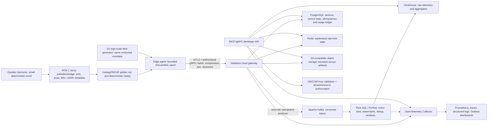
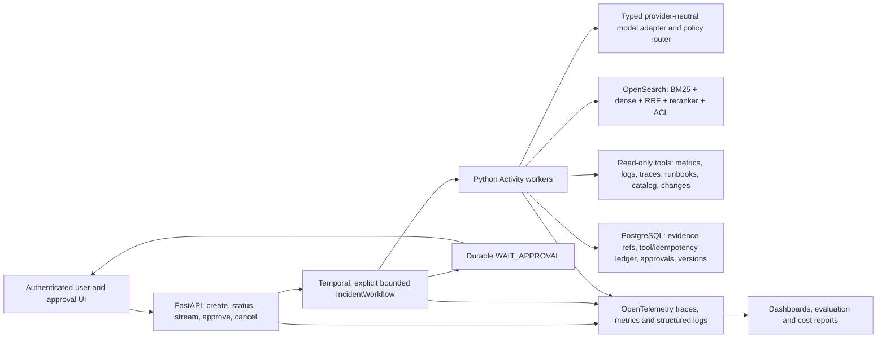

# Evidence-Based Platform and Agentic AI Career Plan

**Candidate:** Pham Duy Tung  
**Research date:** 16 July 2026  
**Location assumption:** Ho Chi Minh City, Vietnam; remote and relocation options are not assumed  
**Planning envelope:** 24 weeks, 10 hours/week, approximately 240 hours, up to USD 500  

## How to read this report

This report separates three kinds of statement:

- **Fact from the supplied profile:** an achievement or technology explicitly supplied by the candidate.
- **Externally verified fact:** a current job description, specification, official documentation page, paper, or maintained repository linked directly in the report.
- **Assessment:** my hiring judgment, prioritization, effort estimate, or proposed design. Assessments are labelled or phrased as recommendations rather than facts.

The two fit scores are decision aids, not applicant-tracking-system probabilities. They weight demonstrated production outcomes much more heavily than courses, and direct domain evidence more heavily than transferable similarity. The supplied profile is detailed, but it is not a complete CV and the two primary job descriptions are summaries rather than live links; each score therefore has a range.

---

# Part 1 — Executive assessment

## 1.1 The professional narrative

The truthful narrative is:

> A senior distributed-systems and observability engineer who has already operated high-volume streaming, search, multi-tenant, and analytical infrastructure, and is now extending that production discipline into cloud-edge telemetry and evaluated, observable AI workflows.

This is stronger than trying to appear to be a robotics engineer or an agent expert today. The candidate's unusual advantage is not “knowing AI tools.” It is knowing how messages are lost, retries duplicate side effects, queues overload, observability becomes expensive, and apparently simple backends fail at scale. Those are valuable foundations in both target roles. The missing evidence is domain-specific: physical/edge workloads and ML lifecycle for Job A; LLM, agent, and evaluation systems for Job B.

## 1.2 Current fit and application decision

| Target | Current fit | Plausible range | Confidence | Recommendation now | Why |
|---|---:|---:|---|---|---|
| **Job A — Platform Engineer, robotics developer platform** | **68/100** | 64–72 | Medium-high | **Apply while learning.** Start applications now; complete a short, credible cloud-edge telemetry slice before likely technical rounds. | Strong direct production proof for Go, streaming, delivery semantics, data platforms, Kubernetes, observability, and reliability. Direct robotics/edge, Helm/IaC, event-time engine, API security/metering, and ML-platform proof is absent. |
| **Job B — Senior Software Engineer, Agentic AI Systems** | **43/100** | 38–48 | Medium-high | **Complete a substantial project first.** Apply earlier only to adjacent AI infrastructure/platform roles that do not claim prior agent ownership. | The production engineering substrate is strong and semantic search is relevant, but there is no supplied proof of an LLM application, RAG generation, agent workflow, AI evaluation, tool safety, or LLM-specific observability. |

### Scoring basis

For Job A, the score rewards production distributed/streaming systems, backend and data infrastructure, operations, and performance. It discounts keyword matches where the actual domain behavior is missing: Kubernetes is not Helm, semantic search is not a robotics vector-store use case, and a reliable cloud queue is not intermittent cloud-edge synchronization.

For Job B, the score gives substantial credit for production software, distributed execution, retrieval, observability, and reliability. It gives almost no credit for unbuilt AI-specific layers. A course or framework tutorial may improve interview readiness but will not materially move the score; the scored evidence must be a tested system and a credible evaluation report.

## 1.3 Strongest matching signals

### Job A

1. High-throughput Kafka consumers in Go with batching, concurrency-safe writes, manual offsets, and migration of millions of records without loss or duplication.
2. NATS Core-to-JetStream migration with persistence and acknowledgements, achieving zero message loss for critical streams.
3. Observability redesign handling more than 15 TB of logs/month, cutting query latency about 75% and storage cost about 40%.
4. CDC and distributed worker pipelines at material scale, including more than 50 million records/month and more than 5 million records aggregated in under three minutes.
5. Kubernetes, gRPC, Prometheus, OpenTelemetry, PostgreSQL, Redis, ClickHouse, multi-tenancy, idempotency, and incident-oriented reliability experience.

### Job B

1. Seven years of production backend and distributed-systems work rather than notebook-only prototyping.
2. Hybrid keyword-and-semantic OpenSearch system with a measured approximate 35% matching improvement over more than 50,000 daily searches.
3. Strong Python plus production APIs, queues, concurrency, idempotency, retries, dead-letter handling, and durable messaging concepts.
4. Deep observability and cost/performance ownership, immediately transferable to agent traces, tool failures, latency, and cost controls.
5. Multi-tenant SaaS and transactional correctness experience, useful for tool authorization, tenant-aware retrieval, auditability, and safe side effects.

## 1.4 Five largest gaps

| Job A | Job B |
|---|---|
| No direct robotics, ROS 2, physical sensor, or fleet-operations evidence | No shipped or production-style LLM application |
| No cloud-edge/offline store-and-forward proof | No RAG with generation, citations, and retrieval evaluation |
| Docker, Helm, and IaC are not explicitly demonstrated | No explicit agent state machine, tool system, or durable execution |
| No Flink/event-time/watermark implementation evidence | No task dataset, regression harness, groundedness, or task-completion evaluation |
| No model registry, policy rollout, inference, HIL simulation, or training-data lineage evidence | No prompt-injection defense, tool authorization, token/cost telemetry, or provider-failure handling |

## 1.5 Primary and secondary track

- **Primary for the next six weeks: Platform/robotics infrastructure.** It is the shortest path to interviews and builds missing cloud-edge, event-time, deployment, API-security, and ML-lifecycle proof.
- **Secondary from week 2, dominant after week 6: production Agentic AI systems.** Build one explicit, durable incident-investigation workflow around the candidate's observability expertise. Avoid a generic chatbot and avoid multi-agent complexity until a single workflow is measured.
- **Hybrid end state:** AI infrastructure / AI platform / production AI systems is the strongest long-term intersection. It uses the candidate's existing production depth while Project 2 supplies honest AI-system evidence.

---

# Part 2 — Requirement matrices

## 2.1 Job A — Platform Engineer for cloud-and-edge robotics

Importance is relative to this specific supplied role, not the whole platform market. “Evidence strength” uses the required vocabulary exactly.

| Requirement | Importance | CV evidence | Evidence strength | Gap | Action |
|---|---|---|---|---|---|
| 4+ years in platform, infrastructure, data, or backend engineering | Critical | Approximately seven years as a Senior Software Engineer; multiple production platform and pipeline achievements | Direct and strong | None material | Lead the summary with years, scale, and ownership rather than a tool list. |
| Go and Python | Critical | Both are primary languages; Go is used in high-throughput Kafka consumers | Direct and strong | Python project depth is not described in detail | Use Go for edge/ingestion and Python/Flink SQL for processing; retain truthful language scope. |
| Concurrency and systems performance | Critical | Concurrency-safe Kafka writes; 10x reindexing improvement; 5M records in under three minutes; large latency/cost reductions | Direct and strong | No explicit profiling method or capacity model supplied | Prepare one benchmark narrative including workload, bottleneck, change, measurement, and trade-off. |
| Distributed infrastructure across cloud and edge | Critical | Distributed cloud pipelines, queues, workers, and SaaS are demonstrated | Adjacent and transferable | No edge node, intermittent network, local buffer, or fleet topology | Build Project 1 store-and-forward gateway and failure tests; do not relabel existing cloud work as edge. |
| Real-time telemetry, sensory, and control data | Critical | Event streams and operational telemetry/observability data at scale | Adjacent and transferable | No video, audio, LiDAR, joint states, command acknowledgements, or physical safety boundary | Simulate bounded representative envelopes and control acknowledgements; learn formats, timestamps, and QoS rather than robotics control theory. |
| Kafka or similar streaming | Critical | Kafka consumers, NATS/JetStream, Azure Service Bus, ordered workflows, retries, DLQs | Direct and strong | No stateful event-time processor | Keep Kafka in implementation; compare JetStream in an ADR; add Flink SQL/PyFlink event-time processing. |
| Flink or equivalent; event time, watermarks, late data | High | No explicit engine or watermark evidence | Portfolio evidence needed | Likely interview blocker | Implement windowed fleet-health aggregate with bounded out-of-orderness, late-event side output, checkpoint/recovery test. |
| Delivery semantics, replay, idempotency, ordering | Critical | Manual Kafka offsets, transactional outbox, idempotency keys, JetStream acknowledgements, DLQs and ordered Service Bus workflows | Direct and strong | Must articulate end-to-end rather than broker-only “exactly once” | Write an ADR tracing every failure window and the sink idempotency key. |
| gRPC, REST, and WebSockets | High | gRPC and Socket.io are explicit; backend APIs are a primary strength | Direct but limited | REST is described generically; no gRPC streaming or raw WebSocket flow-control proof | Implement bidirectional gRPC stream; document when REST and WebSockets are preferable. |
| External developer-platform/API product | High | Backend APIs and a SaaS platform supporting 1,000+ tenants | Adjacent and transferable | No explicit external SDK, API lifecycle, developer docs, or deprecation policy | Publish OpenAPI/protobuf, quick-start client, versioning policy, error model, and usage dashboard. |
| Kubernetes operation | Critical | Kubernetes explicitly demonstrated | Direct but limited | Scope/depth, upgrades, networking, autoscaling, and incident ownership are unspecified | Add k3d/kind deployment, resource limits, disruption budget, HPA, rollout/rollback, and failure evidence. |
| Docker/containerization | High | Not explicitly demonstrated | Unknown | Screening and interview risk; it cannot be inferred from Kubernetes | Add multi-stage images, non-root runtime, health checks, SBOM/vulnerability scan, and documented image sizes. |
| Helm | High | Not explicitly demonstrated | Missing | Short, closeable application/interview gap | Package Project 1; include values schema, chart tests, upgrade/rollback test, and least-privilege manifests. |
| Terraform or OpenTofu | High | Not explicitly demonstrated | Missing | Short, closeable interview gap | Create a small reusable OpenTofu module and tests; one low-cost cloud deployment is optional. |
| Autoscaling, failover, disaster recovery | Critical | Reliability work and persistent messaging are demonstrated | Adjacent and transferable | No explicit HPA, failover target, RTO/RPO, or DR exercise | Define SLO/RTO/RPO, scale on queue lag, kill broker/consumer, time recovery, and write a restore runbook. |
| PostgreSQL, Redis, ClickHouse, object storage | High | PostgreSQL, Redis, ClickHouse direct; ClickHouse operated at 15+ TB logs/month | Direct and strong | Object storage is not listed | Use PostgreSQL/Redis/ClickHouse directly; add S3-compatible object storage only for sensor artifacts. |
| Vector storage | Medium | OpenSearch semantic search is demonstrated | Adjacent and transferable | “Vector database operation” and a robotics use case are not established | Do not force it into Project 1; mention OpenSearch only if semantic search over fleet incidents/runbooks is added later. |
| Prometheus, OpenTelemetry, tracing, logs, dashboards | Critical | Prometheus, OpenTelemetry, Jaeger, Loki, ClickHouse log storage, tracing and monitoring infrastructure | Direct and strong | Grafana is not explicit; specific SLO/alert ownership is not described | Add RED/USE, queue lag, late events, loss/duplicates, cost, traces, dashboards, and burn-rate alerts. |
| Monitoring, alerting, incident response | Critical | Observability redesign and reliability ownership are direct; incident process is not explicitly described | Direct but limited | No supplied on-call, SLO, postmortem, or incident-command evidence | Run a failure exercise and publish a blameless postmortem with detection/mitigation timestamps. |
| Authentication and secure API keys/OAuth/OIDC | High | No explicit authentication design in supplied achievements | Unknown | Likely interview blocker | Implement workload/device identity plus user/API authentication; explain OAuth authorization versus OIDC authentication. |
| Authorization and tenant isolation | Critical | 1,000+ tenant SaaS with data isolation and feature tiers | Direct but limited | Mechanism, policy model, and tests are unknown | Add tenant-scoped claims, RBAC or policy decision, negative tests, and audit log. |
| Rate limiting, quotas, usage metering | High | Feature-tier management is adjacent; explicit enforcement/metering is absent | Portfolio evidence needed | Likely interview blocker for a developer platform | Implement token bucket at tenant/device key, quota policy, idempotent usage ledger, and billing-neutral usage report. |
| Intermittent connectivity and store-and-forward | Critical | Retries and durable brokers are cloud-side experience | Adjacent and transferable | No bounded local spool, reconnect protocol, cursor, clock skew, or conflict handling | Project 1 must disconnect, fill a bounded spool, shed by policy, reconnect, resume, and prove no silent loss. |
| Time synchronization and schema evolution | High | CDC and event systems imply schema concerns, but neither is explicitly evidenced | Portfolio evidence needed | Sensor event-time correctness and clock uncertainty are unproved | Store event, ingest, and monotonic sequence data; inject skew; version protobuf; test backward/forward compatibility. |
| ROS 2 and robotics middleware concepts | High | None supplied | Missing | Domain interview blocker, though full robotics programming is not required | Study nodes/topics/services/actions, DDS/QoS, frames, and common `sensor_msgs`; use a small adapter or schema mapper. |
| Model registry, model versioning, and policy rollout | High | No direct ML lifecycle evidence | Missing | Likely interview blocker for ML-team support | Register a tiny CPU model in MLflow, promote by alias, canary a version, record rollback and lineage metadata. |
| Inference pipeline and training-data lineage | High | Data pipelines are transferable | Adjacent and transferable | No model serving, feature/schema contract, lineage, or inference SLO | Serve a lightweight anomaly model, attach model/data version to outputs, and test fallback. |
| Hardware-in-the-loop simulation | Medium | None supplied | Missing | Helpful differentiator; likely learnable on the job | Create awareness and a design note; do not build physical hardware in this plan. Use deterministic simulator/replay as software-in-the-loop. |
| Distributed training and large-scale simulation | Low-to-medium | Distributed data processing, not model training | Adjacent and transferable | No GPU, training collective, scheduler, or simulation-farm evidence | Learn architecture and scheduling vocabulary only; defer hands-on distributed training unless the actual interview emphasizes it. |
| Technical ownership and cross-team support | High | Multiple end-to-end migrations and platform redesigns imply ownership; team influence is not explicitly supplied | Direct but limited | Scope of leadership, decisions, mentoring, and stakeholder coordination is unknown | Prepare factual stories; never invent team size or authority. Quantify decisions, reviews, rollout, and operational ownership where true. |

### Job A gap classification

| Classification | Gaps |
|---|---|
| **Application blocker** | If the employer treats prior robotics as mandatory: direct robot/sensor/edge evidence. Otherwise no absolute blocker; the candidate already meets the general platform tenure and core backend bar. |
| **Likely interview blocker** | Cloud-edge failure model; event time/watermarks; Docker/Helm/IaC; ROS 2/QoS basics; OAuth/OIDC and authorization; quota/metering; model registry/rollout. |
| **Helpful differentiator** | A measured loss/recovery benchmark, HIL design, OPA policy example, training-data lineage, fleet-specific SLOs, and cost model. |
| **Can reasonably be learned on the job** | Specific robot vendor/hardware, detailed LiDAR calibration, a company-specific control plane, managed-cloud products, and deeper simulation tooling. |
| **Unnecessary for this role now** | Rust, C++, CUDA, robot motion planning/control algorithms, foundation-model training, and a forced vector database with no valid workload. |

### Job A decision

**Apply while learning.** A two-week architecture plus working edge-spool/gRPC slice is enough to improve interview credibility; the six-week milestone is enough for a polished portfolio MVP. Do not wait for the complete 24-week plan.

## 2.2 Job B — Senior Software Engineer, Agentic AI Systems

| Requirement | Importance | CV evidence | Evidence strength | Gap | Action |
|---|---|---|---|---|---|
| 5+ years software engineering | Critical | Approximately seven years; current Senior Software Engineer | Direct and strong | None material | Lead with production ownership and measurable outcomes. |
| Strong Python | Critical | Python is a primary language | Direct but limited | No supplied Python-specific project scale or typing/testing evidence | Project 2 should be a typed, tested Python service; do not claim ML Python depth from language listing alone. |
| Distributed systems and cloud-native backend services | Critical | Kafka/NATS/Service Bus, workers, APIs, Kubernetes, multi-tenant SaaS | Direct and strong | None for the general backend layer | Reuse real failure and idempotency stories; connect them explicitly to agent tool execution. |
| Reliability, observability, and performance engineering | Critical | Large, measured observability and performance outcomes | Direct and strong | No nondeterministic AI reliability evidence | Instrument each model/retrieval/tool/workflow step and define AI-specific SLOs. |
| Production LLM application | Critical | None supplied | Missing | Application blocker | Build and operate Project 2; a course is not evidence. |
| Transformer, tokenization, context-window fundamentals | High | None supplied | Missing | Interview blocker at engineering depth | Study selected CS336/FSDL material; implement token-budget and truncation tests, not model training. |
| Embeddings and vector retrieval | High | Hybrid keyword-and-semantic OpenSearch matching | Direct but limited | Embedding/model/index details and vector operational depth are unknown | Benchmark lexical, dense, hybrid, and reranked retrieval on an incident corpus. |
| Hybrid search and reranking | High | Hybrid search direct; measured relevance improvement | Direct and strong | Reranking is not explicit; prior metric definition is unknown | Reuse OpenSearch; publish nDCG@k/MRR/Recall@k and latency/cost comparison. |
| RAG, grounded generation, and citations | Critical | Semantic retrieval is not RAG | Portfolio evidence needed | Application and interview blocker | Add evidence packs, generation constrained to retrieved facts, claim-to-source citations, abstention, and tests. |
| Structured output and tool calling | Critical | Typed backend APIs are transferable; no LLM tool calls | Portfolio evidence needed | No tool schema, validation, or model/tool error handling | Use typed schemas, reject invalid arguments, give tools narrow read-only interfaces, and record every call. |
| Planning and explicit agent state machine | Critical | Ordered event workflows are transferable | Adjacent and transferable | No model-driven or explicit agent workflow | Implement a small finite workflow: intake → retrieve → plan → execute read-only tools → verify → report/approval. |
| Durable execution, cancellation, retries, and timeouts | Critical | Durable messaging, retries, DLQs, idempotency direct | Adjacent and transferable | No durable AI workflow or replay-safe model/tool boundary | Use Temporal plus explicit state; make activities idempotent; test crash/restart, cancellation, timeout, and version change. |
| Idempotency for tool side effects | Critical | Idempotency keys and transactional outbox in currency service | Direct and strong | Not applied to AI-selected tools | Derive operation key from workflow/tool/normalized args; keep write tools mocked and approval-gated. |
| Short-term and long-term memory | Medium | No agent memory supplied | Missing | Short-term state required; long-term memory may be unnecessary | Persist workflow evidence/state. Defer cross-session “memory” until an evaluated use case exists. |
| Multi-agent orchestration | Medium | None supplied | Missing | Not a blocker if a single explicit workflow solves the task | Do not implement initially. Add only through an ablation showing measurable gain over one workflow. |
| Evaluation dataset and offline regression suite | Critical | No LLM evaluation evidence | Missing | Application blocker | Start with 30–50 versioned scenarios, deterministic outcomes, negative controls, repeated trials, and failure taxonomy. |
| Task completion and correctness evaluation | Critical | General production testing is transferable | Adjacent and transferable | No agent outcome graders | Grade final environment/evidence state first; use model judges only for calibrated subjective dimensions. |
| Retrieval and groundedness evaluation | Critical | Search match accuracy improved ~35%, but method is not supplied | Direct but limited | No supplied qrels, retrieval metric, unsupported-claim, or citation check | Create qrels and deterministic citation/claim support checks; document label process and inter-rater uncertainty. |
| Online evaluation and feedback loops | High | Operational telemetry is transferable | Adjacent and transferable | No sampled production trace review, feedback model, or drift policy | Design shadow/canary and sampled human review; a local project may simulate online evaluation. |
| LLM-as-judge limitations and human calibration | High | None supplied | Missing | Interview risk | Compare judge scores to human rubric on a sample; report disagreements, position bias, and variance. |
| Latency, tokens, cost, and model routing | Critical | Performance/cost optimization direct but not LLM-specific | Adjacent and transferable | No token accounting, budget enforcement, cache, or provider routing | Set per-task budgets; record p50/p95/p99, tokens, dollars, fallback, and quality/cost frontier. |
| Agent tracing and AI observability | Critical | OpenTelemetry/tracing platform expertise | Adjacent and transferable | General tracing is not AI evaluation | Add spans for model, retrieval, tool, approval, retry; include prompt/workflow/model versions and eval outcome. |
| Provider outage and dependency failure | High | Message/service failure handling direct | Adjacent and transferable | No model-provider failure simulation or semantic fallback | Inject 429/5xx/timeout/malformed output; test bounded retry, circuit break, alternate model, and graceful partial report. |
| Prompt injection and untrusted retrieved content | Critical | No AI security evidence | Missing | Likely interview blocker | Separate instructions from data, provenance-tag content, least-privilege tools, test indirect injection with AgentDojo-inspired cases. |
| Tool authorization, sandboxing, and audit | Critical | Multi-tenant isolation is transferable; no agent tool security | Adjacent and transferable | No policy at tool/tenant/resource level | Default read-only; enforce tenant/resource policy outside the model; no unrestricted shell; immutable audit trail. |
| Model serving/inference infrastructure | Medium | No direct model serving | Missing | Helpful for AI-infrastructure titles; not essential when using hosted APIs | Build provider-independent boundary and one small local model option; defer GPU orchestration. |
| Knowledge graphs | Low-to-medium | None supplied | Missing | Preferred in some roles but not core to the proposed incident workflow | Learn awareness; do not add a graph unless relationship traversal beats metadata-filtered search on measured tasks. |
| Multi-tenancy and secure production deployment | High | 1,000+ tenant SaaS, data isolation, Kubernetes | Direct and strong | AI-specific retrieval/tool leakage tests absent | Add tenant-aware index filters, authorization negatives, rate limits, secrets/config, and audit tests. |
| Technical leadership and productionizing prototypes | High | End-to-end platform redesigns/migrations with measured results; leadership scope unspecified | Direct but limited | No cross-functional AI-platform leadership evidence | Use architecture decisions, rollout and operations stories honestly; Project 2 design/review artifacts can add evidence, not retroactively create management scope. |

### Job B gap classification

| Classification | Gaps |
|---|---|
| **Application blocker** | A working LLM system; grounded RAG; explicit tool workflow; durable execution; evaluation dataset/report. These are absent today. |
| **Likely interview blocker** | Token/context fundamentals; agent state; failure recovery; deterministic versus model graders; prompt injection; tool authorization; model routing; AI observability and cost. |
| **Helpful differentiator** | Retrieval ablations, repeated-trial reliability, tenant isolation tests, a provider-outage postmortem, Temporal workflow versioning, and calibrated judge analysis. |
| **Can reasonably be learned on the job** | The employer's model vendor, prompt DSL, hosted observability product, proprietary agent framework, and domain ontology. |
| **Unnecessary for this role now** | Training a foundation model, CUDA/Triton, distributed GPU training, a swarm of agents, unrestricted code execution, and a knowledge graph without measured benefit. |

### Job B decision

**Complete a substantial project first.** The minimum credible threshold is not “the agent answers questions.” It is a versioned workflow that survives restart, uses controlled tools, cites evidence, passes a repeatable scenario suite, exposes traces/cost, and documents failures and security boundaries. Apply to adjacent AI platform/infrastructure roles earlier if the description values distributed systems and does not require prior production agent ownership.

---

# Part 3 — Prioritized competency map

## 3.1 Legend and prioritization rule

- **P0:** needed to pass likely interviews or perform a central responsibility.
- **P1:** strong differentiator or needed soon after the P0 layer.
- **P2:** useful awareness/working knowledge, but not worth displacing portfolio delivery.
- **P3:** defer in this 24-week plan.
- **Depth** is the level required for the target jobs, not the candidate's current level.
- **Current** is based only on the supplied profile: **Strong**, **Limited**, **Adjacent**, **Missing**, or **Unknown**.
- **★** marks unusually high leverage across both jobs.

## 3.2 A — Shared foundation

| Skill | Priority | Required depth | Current | Evidence-aware direction |
|---|---|---|---|---|
| ★ Distributed-system failure models and partial failure | P0 | Can design and lead | Adjacent | Make assumptions and failure windows explicit in both project ADRs. |
| ★ Delivery semantics | P0 | Can design and lead | Strong | Deepen end-to-end semantics; broker acknowledgement alone is not business exactly-once. |
| ★ Idempotency | P0 | Can design and lead | Strong | Reuse idempotency-key/outbox experience for telemetry sinks and AI tool activities. |
| Ordering | P0 | Can design and lead | Strong | Cover per-key order, rebalances, retries, late data, and when global order is infeasible. |
| Consistency and isolation | P0 | Can design and lead | Strong/limited | Tie pessimistic locking and outbox work to isolation anomalies and distributed boundaries. |
| Consensus | P1 | Working knowledge | Adjacent | Explain Raft/leader election/quorum and operational consequences; do not implement a new consensus system. |
| Replication | P0 | Can design and lead | Adjacent | Cover lag, failover, split brain, RPO/RTO, and cross-region trade-offs. |
| Partitioning and hot keys | P0 | Can design and lead | Strong/limited | Extend Kafka/OpenSearch experience into fleet/device and tenant partition design. |
| ★ Backpressure and bounded queues | P0 | Can operate in production | Adjacent | Demonstrate bounded memory and overload behavior in both projects. |
| ★ Load shedding and graceful degradation | P0 | Can implement independently | Adjacent | Define priority classes and what can be sampled/dropped versus never silently lost. |
| ★ Rate limiting and quotas | P0 | Can implement independently | Limited | Build tenant/device token buckets plus quota and budget policies. |
| ★ Capacity planning | P0 | Can design and lead | Adjacent | Turn throughput/latency/cost measurements into an explicit model. |
| Tail latency | P0 | Can operate in production | Strong/limited | Always publish p50/p95/p99 and coordinated-omission caveats, not averages alone. |
| Linux process, memory, file, and network diagnostics | P0 | Can operate in production | Unknown | Verify through hands-on profiling; study only gaps revealed by diagnostics. |
| Networking: TCP, HTTP/2, DNS, TLS, proxies, timeouts | P0 | Can operate in production | Adjacent | Focus on long-lived streams, reconnects, connection draining, and proxy limits. |
| Kubernetes workload operation | P0 | Can operate in production | Limited | Add rollouts, disruption, resources, security, autoscaling, and recovery evidence. |
| ★ Performance engineering and benchmarking | P0 | Can design and lead | Strong | Preserve workload definition and reproducibility; add resource/cost curves. |
| ★ SLIs, SLOs, error budgets, and alerting | P0 | Can design and lead | Limited | Produce one measured SLO document and burn-rate alerts per project. |
| ★ Incident response and postmortems | P0 | Can operate in production | Limited | Conduct failure drills; show detection, decision, mitigation, learning, and follow-through. |
| ★ Security threat modelling | P0 | Can implement independently | Unknown | Create data-flow threat models, trust boundaries, misuse cases, and negative tests. |
| ★ Multi-tenancy and isolation | P0 | Can design and lead | Strong/limited | Make tenant identity part of every storage, retrieval, tool, quota, and audit path. |
| API and schema design | P0 | Can design and lead | Strong/limited | Version protobuf/OpenAPI, errors, compatibility, pagination, retries, and idempotency. |
| ★ Testing distributed systems | P0 | Can implement independently | Adjacent | Add property/invariant tests, deterministic simulation, fault injection, replay, and recovery assertions. |
| Concurrency safety | P0 | Can design and lead | Strong | Prepare race, cancellation, shutdown, resource-bound, and batching trade-offs. |
| Data lineage and versioned artifacts | P1 | Can implement independently | Adjacent | Track schema/data/model/prompt/workflow versions through outputs and traces. |
| Technical design writing and ADRs | P0 | Can design and lead | Unknown | Each consequential choice needs context, options, decision, consequences, and reversal path. |

## 3.3 B — Platform and robotics-infrastructure specialization

| Skill | Priority | Required depth | Current | Evidence target |
|---|---|---|---|---|
| Edge-computing constraints | P0 | Working knowledge | Missing | Resource budgets, unreliable links, remote upgrades, identity, local durability. |
| Cloud-edge synchronization | P0 | Can implement independently | Missing | Cursor/ack protocol, duplicate handling, version conflicts, resumability. |
| Intermittent connectivity | P0 | Can implement independently | Missing | Repeatable disconnect/reconnect and long-offline tests. |
| Store-and-forward | P0 | Can implement independently | Missing | SQLite/WAL-backed bounded spool, priority and eviction policy. |
| Sensor-data ingestion | P0 | Can implement independently | Adjacent | Typed joint/pose/health/control and representative artifact metadata. |
| Video streaming fundamentals | P1 | Working knowledge | Missing | Codec/container, keyframes, bitrate, jitter, metadata versus bulk object path. |
| Audio streaming fundamentals | P1 | Working knowledge | Missing | Sampling, framing, codec, jitter, privacy, and separate metadata/object path. |
| LiDAR and point-cloud formats | P1 | Working knowledge | Missing | Understand ROS `LaserScan`/`PointCloud2`, coordinate frame and payload size; samples only. |
| Time synchronization and clock uncertainty | P0 | Can implement independently | Missing | Event/ingest timestamps, monotonic device sequence, injected skew, uncertainty policy. |
| Event-time processing | P0 | Can implement independently | Missing | Flink SQL/PyFlink window with watermarks and replay-correct output. |
| Out-of-order and late data | P0 | Can implement independently | Adjacent | Allowed lateness, side output/correction, metric and user-visible semantics. |
| Kafka architecture and operation | P0 | Can design and lead | Strong | Partition/retention/replay/rebalance/recovery ADR and benchmark. |
| Flink | P0 | Can implement independently | Missing | Event time, state, checkpoints, backpressure, failure recovery; not Java mastery. |
| NATS JetStream | P1 | Can design and lead | Strong | Use as reasoned comparison or edge alternative, not a duplicate implementation. |
| Schema evolution | P0 | Can design and lead | Limited | Protobuf compatibility tests and invalid/unknown-version quarantine. |
| gRPC streaming | P0 | Can implement independently | Limited | Bidirectional stream, flow control, deadlines, keepalive, reconnect, auth. |
| WebSockets | P1 | Can implement independently | Limited | Compare browser reach and app-level flow control with gRPC. |
| Kubernetes operators | P2 | Working knowledge | Missing | Explain reconciliation/idempotence; defer custom operator unless a real need emerges. |
| Helm | P0 | Can implement independently | Missing | Tested chart, values schema, upgrades and rollback. |
| Terraform/OpenTofu | P0 | Can implement independently | Missing | Reusable tested module and remote-state/security awareness. |
| Autoscaling | P0 | Can operate in production | Adjacent | Scale consumers on lag with stabilization and capacity bounds. |
| Failover and disaster recovery | P0 | Can design and lead | Adjacent | Broker/consumer/database failures, restore runbook, measured RTO/RPO. |
| PostgreSQL | P0 | Can operate in production | Strong | Metadata/control/idempotency; no beginner study. |
| Redis | P1 | Can operate in production | Strong | Ephemeral rate-limit state; describe failure and consistency implications. |
| ClickHouse | P0 | Can design and lead | Strong | Telemetry schema, partitions/order keys, retention, compression, query/cost proof. |
| Object storage | P1 | Can implement independently | Missing | Multipart/immutable artifact path, checksum, lifecycle and signed access. |
| Vector storage | P2 | Working knowledge | Adjacent | Use only for a measured fleet/runbook retrieval need. |
| API gateway patterns | P1 | Can implement independently | Adjacent | Auth, limits, routing, observability, streaming caveats, and failure modes. |
| OAuth 2.0 and OIDC | P0 | Can implement independently | Unknown | Correct authorization/authentication distinction, validation, scopes/audience/expiry. |
| Authorization (RBAC/policy) | P0 | Can design and lead | Limited | Tenant/device/resource/action policy enforced outside handlers. |
| Rate limiting | P0 | Can implement independently | Limited | Token bucket/sliding-window trade-off and distributed consistency. |
| Quotas | P0 | Can implement independently | Limited | Hard/soft, reset windows, reservation, race and overage policy. |
| Usage metering | P0 | Can implement independently | Missing | Immutable/idempotent ledger, aggregation and reconciliation. |
| Model registry | P0 | Can implement independently | Missing | MLflow version/alias/metadata and rollback. |
| Model rollout | P0 | Can implement independently | Missing | Shadow/canary/promotion/rollback with evaluation gate. |
| Inference infrastructure | P0 | Can implement independently | Missing | Small CPU service, batching/timeout/fallback/model version in response. |
| ML metadata | P1 | Can implement independently | Missing | Run, data, code, model, parameter, metric and deployment link. |
| Training-data lineage | P1 | Can implement independently | Adjacent | Trace sample/partition/schema/transformation to model version. |
| Training-data infrastructure | P1 | Can design and lead | Adjacent | Reuse CDC/pipeline strengths; add snapshots, quality and lineage. |
| Hardware-in-the-loop simulation | P2 | Awareness | Missing | Design boundary and test strategy only. |
| Large-scale simulation | P2 | Working knowledge | Adjacent | Scheduling, determinism, artifacts, reproducibility, cost; no simulator farm build. |
| Distributed model training | P2 | Awareness | Missing | Data/model/pipeline parallelism and failure/checkpoint vocabulary only. |
| GPU infrastructure | P3 | Awareness | Missing | Explicitly defer unless a real role makes it central. |
| Robotics middleware concepts | P0 | Working knowledge | Missing | Nodes, topics, services, actions, DDS discovery/QoS, frames and bags. |
| ROS 2 concepts | P0 | Working knowledge | Missing | QoS compatibility, sensor-data profile, rosbag/replay, common messages. |
| OpenTelemetry | P0 | Can design and lead | Strong | Reuse; add messaging/RPC conventions and trace sampling decisions. |
| Prometheus | P0 | Can operate in production | Strong | Reuse; add recording rules, burn rates and cardinality controls. |
| Grafana | P1 | Can implement independently | Unknown | Build reproducible dashboards; do not claim prior use until supported. |

## 3.4 C — Agentic AI systems specialization

| Skill | Priority | Required depth | Current | Evidence target |
|---|---|---|---|---|
| Transformer/LLM fundamentals at engineering depth | P0 | Working knowledge | Missing | Explain attention, inference, sampling, KV cache and practical limits. |
| Tokenization | P0 | Working knowledge | Missing | Measure actual tokens and truncation behavior. |
| Context windows and context management | P0 | Can implement independently | Missing | Evidence selection, compaction, budgets, overflow and version tests. |
| Embeddings | P0 | Can implement independently | Limited | Model choice, normalization, indexing, drift/version and latency. |
| Retrieval | P0 | Can design and lead | Strong/limited | Turn relevance experience into explicit qrels and metrics. |
| Hybrid search | P0 | Can design and lead | Strong | Reuse OpenSearch and compare fusion strategies. |
| Reranking | P0 | Can implement independently | Missing | Cross-encoder/top-k quality-latency ablation. |
| RAG | P0 | Can implement independently | Missing | Full ingest/retrieve/evidence/generate/cite/abstain path. |
| Chunking | P0 | Can implement independently | Missing | Structure-aware baseline, overlap and parent-child ablation. |
| Query transformation | P1 | Can implement independently | Missing | Only if it improves defined retrieval tasks. |
| Grounded generation | P0 | Can implement independently | Missing | Claim-evidence mapping, unsupported-claim metric, abstention. |
| Structured output | P0 | Can implement independently | Missing | Schema validation, repair limit, refusal/error handling. |
| Tool calling | P0 | Can implement independently | Missing | Narrow typed tools, validation, permissions, audit and failures. |
| Planning | P0 | Working knowledge | Missing | Bounded plan with explicit stop/replan criteria; no hidden chain-of-thought dependency. |
| Agent state machines | P0 | Can design and lead | Adjacent | Explicit states/transitions/invariants and version migration. |
| Durable workflows | P0 | Can operate in production | Adjacent | Temporal replay/restart/cancellation/timeout/version tests. |
| Human-in-the-loop workflow | P0 | Can implement independently | Missing | Durable approval event, expiry, reject/edit and authorization. |
| Short-term workflow state | P0 | Can implement independently | Missing | Typed persisted evidence and step status. |
| Long-term memory | P2 | Working knowledge | Missing | Defer until retention, privacy and measured benefit are defined. |
| Agent orchestration | P0 | Can design and lead | Missing | One explicit workflow first; bounded dynamic routing. |
| Multi-agent trade-offs | P2 | Working knowledge | Missing | Understand coordination/error/cost overhead; no build without ablation gain. |
| Model routing | P1 | Can implement independently | Missing | Capability/latency/cost policy, health and quality gate. |
| Retries, fallbacks and circuit breaking | P0 | Can design and lead | Strong/adjacent | Retry taxonomy for rate limit, timeout, invalid output and semantic failure. |
| Idempotent tool execution | P0 | Can design and lead | Strong/adjacent | Stable operation keys, dedupe ledger and outcome lookup. |
| Sandboxing | P0 | Working knowledge | Missing | No shell; network and tool allowlists; resource/time bounds. |
| Prompt-injection defence | P0 | Can implement independently | Missing | Indirect injection suite, instruction/data separation, least privilege and provenance. |
| Tool authorization | P0 | Can design and lead | Limited/adjacent | Policy check on principal, tenant, resource, action and arguments. |
| Evaluation datasets | P0 | Can design and lead | Missing | 30–50 balanced versioned tasks with reference outcomes and failure tags. |
| Offline evaluation | P0 | Can design and lead | Missing | Repeat trials, confidence intervals where meaningful, quality/cost/latency report. |
| Online evaluation | P1 | Working knowledge | Missing | Shadow/canary, feedback sampling, review and rollback design. |
| Task-completion evaluation | P0 | Can implement independently | Missing | Inspect final environment/evidence state, not just final prose. |
| LLM-as-judge limitations | P0 | Working knowledge | Missing | Calibrate against humans; test order/verbosity/model bias and disagreement. |
| Deterministic evaluators | P0 | Can implement independently | Adjacent | Tool selection, arguments, expected signals, citations, policy and outcome checks. |
| Groundedness | P0 | Can implement independently | Missing | Claim-level support and unsupported-claim rate. |
| Retrieval evaluation | P0 | Can design and lead | Limited | Recall@k, MRR/nDCG, qrels, error slices and label quality. |
| Regression testing | P0 | Can design and lead | Adjacent | Freeze versioned data/config/model and report deltas with gates. |
| Latency and cost evaluation | P0 | Can design and lead | Adjacent | p50/p95/p99, tokens, dollars, retries, cache and quality frontier. |
| Agent tracing | P0 | Can implement independently | Adjacent | End-to-end trace with model/retrieval/tool/approval spans and evidence IDs. |
| AI observability | P0 | Can design and lead | Adjacent | Operational signals plus eval outcomes; neither substitutes for the other. |
| Token and cost monitoring | P0 | Can implement independently | Missing | Per model/tenant/workflow/step accounting and hard budgets. |
| Production AI incident response | P1 | Can operate in production | Adjacent | Run provider outage, retrieval corruption, runaway loop and leakage drills. |
| Vector database operation | P1 | Can operate in production | Adjacent | OpenSearch indexing/filtering/recall/performance; do not overclaim a separate vector DB. |
| Knowledge graphs | P2 | Awareness | Missing | Learn use cases and graph retrieval; defer build. |
| Semantic caching | P1 | Can implement independently | Missing | Version-aware cache with similarity risk, TTL and evaluation. |
| Model gateway | P1 | Can implement independently | Missing | Provider-independent API, routing, budgets, observability and secrets. |
| Rate limiting | P0 | Can implement independently | Limited | Apply per tenant/model/tool and protect queues/providers. |
| Multi-tenancy | P0 | Can design and lead | Strong/limited | Tenant-aware retrieval, tool policy, caches, traces and budgets. |
| Production deployment | P0 | Can operate in production | Adjacent | Containers, Kubernetes, secrets, scaling, overload, rollback and SLO. |
| Prompt/workflow/model versioning | P0 | Can implement independently | Missing | Stamp every run and evaluation; safe workflow evolution. |
| Output validation and guardrails | P0 | Can implement independently | Missing | Schema, citations, policy and business invariant checks outside the model. |
| Model serving | P2 | Working knowledge | Missing | One local CPU model is enough; defer GPU serving. |
| Tool protocols such as MCP | P2 | Working knowledge | Missing | Understand trust and transport boundaries; internal typed tools remain sufficient. |

## 3.5 Highest-leverage cross-track capabilities

The best shared investments are: (1) explicit failure models, (2) durable state machines, (3) idempotent side effects, (4) backpressure and overload control, (5) tenant-aware authorization, (6) event/evidence lineage, (7) OpenTelemetry traces joined to outcome metrics, (8) SLO/evaluation-driven release gates, (9) capacity and cost modelling, and (10) failure injection with written postmortems. These should be implemented once as reusable engineering habits, not learned twice as separate “robotics” and “AI” topics.

## 3.6 Current hiring-market validation

This is a **purposive 22-role validation sample**, not a statistically representative labor-market survey. Every role below was live on an official company/ATS page on **16 July 2026** and exposed an official date signal within the preceding 180 days. For Greenhouse roles, “ATS updated” is the board's `updated_at` value; it may be an edit, refresh, or republish date and must not be reported as the original posting date. Location and work-authorization constraints mean these are skill evidence, not automatically viable applications.

| Company | Exact title | Official location | Official date signal | Requirements most relevant here | Official source |
|---|---|---|---|---|---|
| IonQ | Staff Distributed Systems Engineer | Santa Clara, California, US | ATS updated 2026-07-14 | Go/Rust, high-throughput telemetry, Kafka, consistency/failure/backpressure/idempotency, K8s/Terraform, OTel/Prometheus/SLO/on-call | [Job](https://job-boards.greenhouse.io/ionq/jobs/6108382004) |
| Armada | Senior Platform/DevOps Engineer (Kubernetes-Linux) | Bellevue, Washington, US | ATS updated 2026-07-13 | Production Kubernetes, bare metal/cloud, Linux/networking, RBAC, Terraform/Ansible/Helm, observability, edge constraints | [Job](https://job-boards.greenhouse.io/armada/jobs/5149774008) |
| Cloudflare | Distributed Systems Engineer — Data Platform — Analytics and Alerts | Hybrid | ATS updated 2026-07-13 | Distributed APIs, Go, SQL/query performance, high-cardinality metrics; Kafka/Flink, IaC and K8s useful; ClickHouse platform | [Job](https://boards.greenhouse.io/cloudflare/jobs/7462803?gh_jid=7462803) |
| Wellhub | Staff Platform Engineer \| Observability | Brazil, remote | ATS updated 2026-06-23 | AWS/K8s, OTel/Prometheus/Grafana/Loki/Tempo, self-service platforms, operators and telemetry cost | [Job](https://job-boards.greenhouse.io/gympass/jobs/8394480002) |
| Censys | Distributed Systems Engineer | Remote, US | ATS updated 2026-06-08 | Go, distributed ingestion/databases/services, cloud queues, fault tolerance; gRPC/REST/Protobuf/K8s differentiators | [Job](https://job-boards.greenhouse.io/censys/jobs/8499166002) |
| Canonical | Distributed Systems Engineer | Home based, worldwide | ATS updated 2026-07-15 | Go/Python services, messaging/data pipelines, telemetry/streaming APIs, IoT, governance/audit/security, technical direction | [Job](https://job-boards.greenhouse.io/canonical/jobs/4581200) |
| Waymo | Senior Backend Engineer, Fleet Infrastructure | San Francisco / Mountain View, US | ATS updated 2026-06-16 | Seven years, backend/infrastructure at scale, fleet systems, architecture and cross-functional ownership; C++ preferred | [Job](https://careers.withwaymo.com/jobs?gh_jid=7859522) |
| Waymo | Senior Machine Learning Infrastructure Engineer, Simulation | Mountain View / San Francisco, US | ATS updated 2026-06-16 | ML lifecycle distributed systems, training, accelerators, sharding/profiling, simulation | [Job](https://careers.withwaymo.com/jobs?gh_jid=7947310) |
| Agility Robotics | Staff HiL SW Infrastructure Engineer | Hybrid, Fremont, US | ATS updated 2026-07-02 | HIL systems, Python/MATLAB/Simulink, Linux RT, sensor/motor emulation, fault injection, physical CI runners | [Job](https://www.agilityrobotics.com/about/job-post?gh_jid=6105233004) |
| Figure | Helix AI Engineer, Backend Infrastructure | San Jose, US | ATS updated 2026-07-13 | Low-latency concurrent robot camera/IMU/telemetry pipelines, Go/Python, streaming, containers, model serving, cloud/edge inference | [Job](https://job-boards.greenhouse.io/figureai/jobs/4685172006) |
| RoboForce | Senior/Staff Embedded Software Engineer, Robotics Platform | Milpitas, US | ATS updated 2026-01-20 | Linux, C++/Python, device deployment/telemetry, DDS, Jetson, performance and platform leadership; ROS bonus | [Job](https://job-boards.greenhouse.io/roboforce/jobs/5076072008) |
| Anthropic | Staff+ Software Engineer, Inference Runtime | Remote-friendly / several US cities | ATS updated 2026-07-14 | Distributed inference performance, accelerator depth, Rust/Python, SLOs, canary/rollback and cross-org leadership | [Job](https://job-boards.greenhouse.io/anthropic/jobs/5257650008) |
| Scale AI | AI Infrastructure Engineer, Model Serving Platform | San Francisco / New York, US | ATS updated 2026-07-09 | Fault-tolerant LLM serving, routing/rate limits/token streaming/budgets, tools/reasoning concepts, K8s/Terraform | [Job](https://job-boards.greenhouse.io/scaleai/jobs/4520320005) |
| Perplexity | Member of Technical Staff (AI Infrastructure Engineer) | San Francisco / Palo Alto, US | `datePosted` 2026-04-13 | K8s operators, Slurm, Python/C++/PyTorch, training/inference clusters, scheduling, benchmarking, ML observability and incidents | [Job](https://jobs.ashbyhq.com/perplexity/598e1f7d-b802-4de2-99ac-90eb2bc33315) |
| Glean | Machine Learning Engineer, LLM Evals & Observability | Mountain View, US | ATS updated 2026-06-25 | Evaluation/golden datasets, human-calibrated judges, launch gates, trace enrichment, pipelines and dashboards | [Job](https://job-boards.greenhouse.io/gleanwork/jobs/4694716005) |
| Glean | Software Engineer, Agents | Bangalore, India | ATS updated 2026-07-10 | Six years, reliable product code, build/evaluate/deploy/operate agents, feedback loops, guardrails, quality/latency/trust/cost | [Job](https://job-boards.greenhouse.io/gleanwork/jobs/4712442005) |
| IMC | Software Engineer — AI Powered Engineering | Chicago, US | ATS updated 2026-06-26 | Agents/tools/MCP, retrieval over engineering artifacts, compile/test/eval safety gates, concurrency and telemetry; direct LLM history not mandatory | [Job](https://job-boards.eu.greenhouse.io/imc/jobs/4682071101) |
| Taxbit | Agentic AI Engineer | Seattle, US | ATS updated 2026-07-07 | At least one year shipping AI/LLM apps, tools/RAG/memory/multi-agent/HITL, evaluation, hallucination mitigation and AI observability | [Job](https://job-boards.greenhouse.io/taxbit/jobs/6111068004) |
| Acquia | Staff AI Engineer (Acquia DAM) | Remote, US | ATS updated 2026-06-23 | Eight years SWE plus three years production agents; LangGraph/Temporal/Pydantic, RAG, eval/tracing, cloud and cost management | [Job](https://job-boards.greenhouse.io/acquia/jobs/8014352) |
| Sonatus | Staff AI Engineer, Agentic AI Application — Office of the CTO | Sunnyvale, US | ATS updated 2026-05-27 | Proven production agent system, RAG/context/eval, continuous data operations, high-performance multi-source systems and staff architecture | [Job](https://job-boards.greenhouse.io/sonatus/jobs/5059580007) |
| Dialpad | Sr AI Engineer — Agentic Systems | Anywhere, US | ATS updated 2026-06-26 | Eight years, distributed infrastructure plus agent architecture, retrieval/memory/tools/HITL, evaluation/observability/safety | [Job](https://job-boards.greenhouse.io/dialpad/jobs/8610775002) |
| Gradial | Applied AI Engineer | Seattle, US | ATS updated 2026-07-14 | Four years plus one year AI/ML apps, autonomous agents over browsers/code/APIs, live evals, tools/memory/evaluators and benchmarks | [Job](https://job-boards.greenhouse.io/gradial/jobs/4251115009) |

### What this sample supports—and what it does not

**Supported qualitative conclusions:** production distributed-systems fundamentals recur across both tracks; operational ownership is part of the engineering job; containers/Kubernetes/IaC remain durable platform signals; production-agent roles treat retrieval, tools, state, evaluation, observability, safety and cost as an integrated system; deep training/inference-infrastructure roles add accelerators, schedulers, profiling and model-serving knowledge.

**Vendor-specific examples, not goals in themselves:** Terraform/Helm/Crossplane; Kafka/Flink/Kinesis; ROS/DDS/Jetson; DeepSpeed/Slurm/vLLM/TensorRT; LangGraph/Temporal/Langfuse/Bedrock. Hiring evidence is stronger when the candidate can explain the underlying behavior and trade-off.

**Rare in this sample but valuable:** deterministic HIL fault injection; high-bandwidth robot media/sensor pipelines joined to model serving; safe inference rollout through shadow/canary/rollback; human-calibrated launch-blocking agent evals; and traces that connect behavior to quality, user feedback, latency and cost.

**Candidate implication:** the sample validates applying now to selected platform/data/observability roles and validates a short edge project for robotics roles. It does not validate calling semantic search “agentic AI experience.” Production-agent roles usually ask for direct tool/state/evaluation/observability evidence. Accelerator-heavy inference/training roles should remain a later specialization.

---

# Part 4 — Curated learning and implementation library

## 4.1 Selection and scoring method

This is a **30-resource cap**, not a reading list to complete end to end. Every item is attached to a roadmap deliverable. Scores use one rubric: target-role/project relevance `R/25`, rigor `D/20`, practical applicability `P/20`, portfolio/interview evidence `E/15`, author/publisher credibility `C/10`, and accessibility/currency/maintenance `A/10`. `93–100 = Priority`, `85–92 = Strong selective study`, and `<85 = Reference only`. A lower score can still be the canonical source for one narrow concept.

The candidate should use the exact scope below. “Read the whole book/course” is deliberately never a dependency.

## 4.2 Shared and Platform/robotics resources (14)

| # | Resource / type; authority and currency | Exact scope; level and focused time | Why this resource, existing strength reused, exact gap closed, and concrete output | Score / label |
|---:|---|---|---|---|
| 1 | [Designing Data-Intensive Applications, 2nd ed.](https://www.oreilly.com/library/view/designing-data-intensive-applications/9781098119058/) — book; Martin Kleppmann and Chris Riccomini, O’Reilly, February 2026; paid/library access | Ch. 2, 5, 6–10, 12–13 only: non-functional requirements, encoding, replication, sharding, transactions, clocks/consistency/consensus and stream processing. Advanced, **10 h**. | Reuses production Kafka/NATS/database experience; closes formal failure/clock/guarantee vocabulary and prevents casual exactly-once claims. Output: six ADRs on identity, partitioning, clocks, outbox, replay/dedup and “no silent loss.” | `24+20+15+12+10+8=89` **Strong** |
| 2 | [MIT 6.5840 Distributed Systems, Spring 2026](https://pdos.csail.mit.edu/6.824/schedule.html) — course/readings; MIT PDOS, current Spring 2026, free | Selected Raft, linearizability, fault-tolerant KV, ZooKeeper, transactions, Spanner and verification; only a failure-oriented lab slice. Graduate, **12 h**. | Reuses distributed services; closes disciplined failure/property reasoning. Output: deterministic restart/partition harness and a one-page distinction between linearizability and per-stream ordering. | `23+20+18+14+10+10=95` **Priority** |
| 3 | [The Site Reliability Workbook](https://sre.google/workbook/table-of-contents/) — official free book; Google, 2018, stable canonical guidance | Ch. 2, 5, 9–11, 13, 16 and SLO worksheets: SLOs, alerts, incidents, load, pipelines and canaries. Intermediate/advanced, **6 h**. | Reuses strong observability/operations; closes explicit SLO, error-budget, runbook and postmortem evidence. Output: SLI/SLO sheet, alerts, incident runbook and injected-outage postmortem. | `24+19+19+15+10+10=97` **Priority** |
| 4 | [Streaming Systems](https://www.oreilly.com/library/view/streaming-systems/9781491983867/) — book; Tyler Akidau, Slava Chernyak and Reuven Lax, O’Reilly, 2018; paid/library access | Ch. 1–2 only: event versus processing time, watermarks, triggers, accumulation, lateness and completeness/latency. Advanced conceptual, **6 h**. | Reuses event pipelines; closes the explicit event-time mental model before Flink APIs. Output: clock/watermark note with 5/30/120-second delay, idle-source, replay and ±60-second skew timelines. | `23+20+17+11+10+8=89` **Strong** |
| 5 | [Apache Flink event-time path](https://nightlies.apache.org/flink/flink-docs-stable/docs/concepts/time/) plus [watermarks](https://nightlies.apache.org/flink/flink-docs-stable/docs/dev/datastream/event-time/generating_watermarks/), [fault tolerance](https://nightlies.apache.org/flink/flink-docs-stable/docs/learn-flink/fault_tolerance/) and [operations playground](https://nightlies.apache.org/flink/flink-docs-stable/docs/try-flink/flink-operations-playground/) — official docs; Flink 2.3.0 released 2026-06-25 | Timestamps, bounded disorder, per-source watermarks, idleness/alignment, windows, allowed lateness/side outputs, state, checkpoints/savepoints, Kafka offsets and backpressure. Advanced implementation, **10 h**. | Reuses Kafka/stream operations; directly closes Flink, event-time and checkpoint evidence. Output: fleet-health job with golden fixtures, late stream, restart/replay test and benchmark; never generalise a scoped Flink guarantee to the whole system. | `25+19+20+15+10+10=99` **Priority** |
| 6 | [ROS 2 Jazzy concepts](https://docs.ros.org/en/jazzy/Concepts/Intermediate.html), [QoS](https://docs.ros.org/en/jazzy/Concepts/Intermediate/About-Quality-of-Service-Settings.html), [security](https://docs.ros.org/en/ros2_documentation/jazzy/Concepts/Intermediate/About-Security.html), [clock design](https://design.ros2.org/articles/clock_and_time.html), [REP-103](https://www.ros.org/reps/rep-0103.html), [REP-105](https://www.ros.org/reps/rep-0105.html), [rosbag2](https://github.com/ros2/rosbag2) and [MCAP](https://mcap.dev/spec) — official docs/spec/repos; Jazzy LTS, MCAP living spec | Topics/services/actions, DDS/RMW, QoS, domains/enclaves, ROS/system/steady time, `tf2`, common sensor messages and MCAP record/replay/index/CRC. Working/advanced, **10 h**. | Reuses Python, schemas and pub/sub; closes robotics middleware, sensor, frame/time and native artifact gaps. Output: `rclpy` publisher, MCAP golden run/replay and sensor-QoS/cloud-policy ADR; this is software-in-the-loop, not hardware evidence. | `25+18+20+15+10+10=98` **Priority** |
| 7 | [Gazebo Harmonic sensors](https://gazebosim.org/docs/harmonic/sensors/) and [ROS 2 integration](https://gazebosim.org/docs/harmonic/ros2_integration/) — official Open Robotics docs; Harmonic LTS supported through September 2028 | Headless SDF world, deterministic stepping/seeds, IMU/contact/LiDAR, joint state/TF, `ros_gz_bridge` and update rates. Working, **6 h**. | Reuses Python/events; adds credible physical-sensor semantics. Output: reproducible headless robot run and bag; retain a simpler Go generator for scale. | `24+17+20+15+10+10=96` **Priority** |
| 8 | [gRPC production guides](https://grpc.io/docs/guides/) — official living docs, current 2025–2026 | Bidirectional streaming, [flow control](https://grpc.io/docs/guides/flow-control/), deadlines/cancel, safe retry, keepalive, TLS/mTLS, health, size limits, compression and performance. Advanced applied, **6 h**. | Reuses Go/gRPC; closes intermittent-link resume and byte-bounded pressure evidence. Output: reconnecting stream with compressed batches, max in-flight bytes, cumulative acks, resume token, jitter and fault benchmark. | `25+18+20+15+10+10=98` **Priority** |
| 9 | [Docker build practices](https://docs.docker.com/build/building/best-practices/) plus Kubernetes [resources](https://kubernetes.io/docs/concepts/configuration/manage-resources-containers/), [probes](https://kubernetes.io/docs/concepts/workloads/pods/probes/), [HPA](https://kubernetes.io/docs/concepts/workloads/autoscaling/horizontal-pod-autoscale/) and [PDB](https://kubernetes.io/docs/tasks/run-application/configure-pdb/) — official living docs; Kubernetes 1.36 current release line at cutoff | Pinned multi-stage/non-root images, SBOM/scan; requests/limits, probes, drain, Deployment/StatefulSet, PDB, lag-aware HPA, RBAC, NetworkPolicy, secrets and rollout. Intermediate/advanced, **10 h**. | Reuses Kubernetes; closes explicit Docker and reproducible production packaging. Output: kind/k3d deploy, resource budget, lag-scale result, rolling update and node-drain record. | `24+18+20+14+10+10=96` **Priority** |
| 10 | [Helm chart guides](https://helm.sh/docs/chart_best_practices/) plus [chart tests](https://helm.sh/docs/topics/chart_tests/) and [OpenTofu docs/tests](https://opentofu.org/docs/cli/commands/test/) — official; Helm docs 4.2.2, OpenTofu 1.12.1 released 2026-05-27 | Values/schema/helpers, immutable images, security context, lint/render/test and overlays; modules, locks, remote/encrypted state, plan/destroy and native tests. Working/advanced, **10 h**. | Reuses Kubernetes/cloud; directly closes Helm and IaC evidence. Output: reusable chart, optional module, CI checks, cost estimate and clean destroy record. | `25+17+20+15+10+10=97` **Priority** |
| 11 | [RFC 9700 OAuth 2.0 Security BCP](https://www.rfc-editor.org/rfc/rfc9700), [OIDC Core](https://openid.net/specs/openid-connect-core-1_0-errata2.html) and [RFC 8707](https://www.rfc-editor.org/rfc/rfc8707) — IETF/OpenID standards, 2023–2025, free | Code+PKCE, client credentials, issuer/audience/signature/expiry/scope, replay/redirect threats, resource binding and 429 contracts. Advanced design, **5 h**. | Reuses APIs/multi-tenancy; closes explicit identity/authentication design. Output: threat model, local-IdP middleware tests, cross-tenant negatives and scoped-token/429 contract. | `25+20+16+13+10+10=94` **Priority** |
| 12 | [Open Policy Agent docs](https://www.openpolicyagent.org/docs), [bundles](https://www.openpolicyagent.org/docs/management-bundles) and [decision logs](https://www.openpolicyagent.org/docs/management-decision-logs) — official; OPA 1.17.0 released 2026-05-28 | Rego tests; tenant/role/scope/resource/action input; deny default; signed bundles/revisions; redacted decision log and control-path fail-closed behavior. Intermediate/advanced, **6 h**. | Reuses multi-tenant APIs; closes policy-as-code and auditable authorization. Output: versioned policy, positive/negative tests and policy-outage test. | `23+18+19+14+10+10=94` **Priority** |
| 13 | [OpenMeter metering architecture](https://openmeter.io/docs/metering/events/how-it-works) and [best practices](https://openmeter.io/docs/metering/guides/best-practices) — official living docs/repo, active through 2026, Apache-2.0 | Immutable CloudEvents usage, subject choice, deduplication, Kafka/ClickHouse aggregation, meter windows, corrections/replay and entitlement-versus-billing boundary. Advanced applied, **6 h**. | Reuses Kafka/ClickHouse/idempotency; closes usage-metering and reconciliation evidence. Output: append-only tenant/device meter, duplicate/replay test and raw-versus-aggregate reconciliation query. | `25+18+20+14+10+10=97` **Priority** |
| 14 | [MLflow Model Registry](https://mlflow.org/docs/latest/ml/model-registry/) plus [KServe canary rollout](https://kserve.github.io/website/docs/model-serving/predictive-inference/rollout-strategies/canary-example/) — official docs; MLflow 3.14.0 (2026-06-17), KServe 0.18.0 (2026-04-29) | Immutable artifact/version/alias/lineage, compatibility metadata, staged registration, shadow/canary metrics, traffic split and rollback. Advanced applied, **8 h**. | Reuses deploy/observability; closes model/policy lifecycle—not model training. Output: tiny registered model, simulated cohort canary, automated guardrail and rollback evidence. | `23+18+19+14+10+10=94` **Priority** |

## 4.3 Agentic AI resources (16)

| # | Resource / type; authority and currency | Exact scope; level and focused time | Why this resource, existing strength reused, exact gap closed, and concrete output | Score / label |
|---:|---|---|---|---|
| 15 | [Stanford CS336, Spring 2026](https://cs336.stanford.edu/) — university course; Tatsunori Hashimoto and Percy Liang, current 2026, free | Only tokenisation, architecture/scaling, inference and evaluation materials—not full assignments. Advanced, **8 h**. | Reuses Python/performance; closes LM token/context/decoding/inference mental model. Output: two-page note and small tokenizer/context/token-cost experiment. | `22+20+14+10+10+10=86` **Strong** |
| 16 | [Retrieval-Augmented Generation for Knowledge-Intensive NLP Tasks](https://arxiv.org/abs/2005.11401) — paper; Patrick Lewis et al., 2020 | Original parametric/non-parametric memory, retrieval-conditioned generation and experiments. Advanced reference, **2 h**. | Reuses semantic search; gives a precise RAG baseline and its historical assumptions. Output: ADR defining what is and is not RAG in Project 2. | `20+20+8+7+10+10=75` **Reference** |
| 17 | [Introducing Contextual Retrieval](https://www.anthropic.com/engineering/contextual-retrieval) — engineering article; Anthropic/Daniel Ford, 2024-09-19 | Contextual chunks, BM25+dense, rank fusion, reranking and ablation. Intermediate, **4 h**. | Reuses OpenSearch hybrid-search work; closes chunk-context/fusion/reranking design. Output: hybrid versus hybrid+reranker ablation; treat reported vendor gains as non-transferable until reproduced. | `24+17+20+14+10+9=94` **Priority** |
| 18 | [Sentence Transformers: Retrieve & Re-rank](https://www.sbert.net/examples/sentence_transformer/applications/retrieve_rerank/README.html) — official UKP Lab docs; package 5.6.0 at cutoff, Apache-2.0 | Bi-encoder candidate retrieval, CrossEncoder reranking, batch/top-k/latency trade-offs. Intermediate, **4 h**. | Reuses Python/search; closes practical reranking. Output: local reranker and quality/latency comparison. | `23+17+20+14+9+10=93` **Priority** |
| 19 | [BEIR benchmark/repository](https://github.com/beir-cellar/beir) — paper/code; Nandan Thakur et al., NeurIPS 2021; repo v2.2.0 (2025-06-04), Apache-2.0, slower maintenance | Heterogeneous IR datasets and nDCG, MAP, Recall, Precision, MRR evaluation patterns. Advanced/practical, **6 h**. | Reuses benchmarking/search; closes reproducible retrieval measurement. Output: BEIR-like incident corpus, qrels and executable report. | `23+19+19+15+10+7=93` **Priority** |
| 20 | [Building Effective Agents](https://www.anthropic.com/engineering/building-effective-agents) — engineering guide; Anthropic/Erik Schluntz and Barry Zhang, 2024-12-19 | Workflow/agent distinction; routing, parallel, orchestrator-worker, evaluator-optimizer, tool design and when simplicity wins. Intermediate, **3 h**. | Reuses distributed decomposition; closes agent pattern/autonomy vocabulary. Output: ADR selecting one bounded workflow with explicit stops and rejecting premature multi-agent design. | `25+18+18+15+10+10=96` **Priority** |
| 21 | [PydanticAI tool contracts](https://pydantic.dev/docs/ai/tools-toolsets/tools/), [structured output](https://pydantic.dev/docs/ai/output/) and [testing](https://pydantic.dev/docs/ai/testing/) — official living docs/repo; v2.10.0 released 2026-07-15, MIT | Provider-neutral typed tools/results, schema validation, dependency injection, deterministic test models and failure/refusal handling; do not use its beta graph as the durability claim. Intermediate, **5 h**. | Reuses Python/API contracts; closes reliable tool and model boundaries. Output: typed `PlanStep`, `EvidenceEnvelope`, `AtomicClaim`, invalid-argument/refusal tests and deterministic fake. | `24+18+20+15+10+9=96` **Priority** |
| 22 | [Temporal Python developer guide](https://docs.temporal.io/develop/python), [workflow execution](https://docs.temporal.io/workflow-execution) and [testing](https://docs.temporal.io/develop/python/best-practices/testing-suite) — official; server v1.31.2 and SDK 1.30.0 in July 2026, MIT | Workflows/Activities/workers, signals/updates, cancel, retry/timeout, deterministic replay, versioning, time-skipping, activity mocks and observability. Advanced, **12 h**. | Reuses queues/idempotency/SRE; closes durable agent execution and HITL recovery. Output: crash-resumable workflow, kill/restart, mock, time-skip and replay-CI tests. | `25+20+20+15+10+10=100` **Priority / backbone** |
| 23 | [Demystifying evals for AI agents](https://www.anthropic.com/engineering/demystifying-evals-for-ai-agents) — engineering guide; Anthropic, 2026-01-09 | Tasks, trials, graders, traces/outcomes, harnesses, repeated evaluation and deterministic/model/human combination. Intermediate, **4 h**. | Reuses test/SRE/benchmark skill; closes nondeterminism, outcome grading and judge calibration. Output: evaluation contract, locked split and aggregation rule before tuning. | `25+19+20+15+10+10=99` **Priority** |
| 24 | [Inspect AI](https://inspect.aisi.org.uk/) and [repository](https://github.com/UKGovernmentBEIS/inspect_ai) — UK AI Security Institute; package 0.3.246 on 2026-07-16, MIT, actively updated | Tasks, solvers, scorers, tool/model execution, sandboxing and structured logs. Intermediate/advanced, **8 h**. | Reuses Python test infrastructure; closes repeatable AI-evaluation harnessing. Output: executable incident tasks/scorers and comparable JSON/log artifacts. | `23+18+20+15+10+10=96` **Priority** |
| 25 | [OpenTelemetry GenAI conventions](https://github.com/open-telemetry/semantic-conventions-genai) plus [2026 guide](https://opentelemetry.io/blog/2026/genai-observability/) — official; active 2026-07-15, Apache-2.0, evolving schema | Spans/metrics for model invocation, agents, tools, evaluation and tokens; privacy and finish reasons. Advanced, **5 h**. | Reuses deep OTel/ClickHouse work; closes model/prompt/workflow versions, token/cost, fallback and eval correlation. Output: pinned schema, end-to-end trace and AI operations dashboard; no prompt-content capture by default. | `25+18+19+15+10+9=96` **Priority** |
| 26 | [OWASP AI Agent Security](https://cheatsheetseries.owasp.org/cheatsheets/AI_Agent_Security_Cheat_Sheet.html) and [Prompt Injection Prevention](https://cheatsheetseries.owasp.org/cheatsheets/LLM_Prompt_Injection_Prevention_Cheat_Sheet.html) — living canonical guidance, checked 2026-07-16 | Least privilege, direct/indirect injection, tool misuse, RAG/memory poisoning, validation, HITL, monitoring, privacy and abuse tests. Intermediate, **5 h**. | Reuses tenant auth/operational safety; closes LLM-specific confused-deputy, injection and excessive-agency risk. Output: threat model, policy middleware and adversarial regression suite. | `25+17+20+15+10+10=97` **Priority** |
| 27 | [Spotlighting indirect prompt injection](https://arxiv.org/abs/2403.14720) — paper; Keegan Hines et al., Microsoft Research, March 2024 | Provenance transformations separating untrusted data from instructions; empirical attack study. Advanced, **3 h**. | Reuses document pipelines; adds one measurable defence, never a security guarantee. Output: provenance transform and with/without attack-success ablation. | `21+18+13+10+10+10=82` **Reference** |
| 28 | [AgentDojo](https://github.com/ethz-spylab/agentdojo) and [paper](https://arxiv.org/abs/2406.13352) — ETH Zurich/Invariant Labs; NeurIPS 2024, repo v0.1.35 (2025-10-27), MIT; API explicitly still evolving | Dynamic tool-agent environment, realistic benign tasks, prompt-injection security cases, attacks/defences and utility-versus-security measurement. Advanced/practical, **6 h**. | Reuses test/security engineering; closes executable adversarial-agent evaluation design. Output: adapt a small attack taxonomy and benchmark format to the incident fixture set; do not make its changing API a production dependency. | `22+18+18+14+10+7=89` **Strong** |
| 29 | [RouteLLM paper](https://arxiv.org/abs/2406.18665) and [reference code](https://github.com/lm-sys/RouteLLM) — LMSYS, 2024, Apache-2.0; no formal releases and examples age | Preference-trained strong/weak-model routing and threshold calibration. Advanced, **4 h**. | Reuses performance/cost optimisation; closes principled cost-quality routing. Output: simple capability/policy router and curve against one-model baseline; concept only, not production dependency. | `21+19+15+11+10+4=80` **Reference** |
| 30 | [Envoy AI Gateway](https://github.com/envoyproxy/ai-gateway) and [v1.0.0](https://github.com/envoyproxy/ai-gateway/releases/tag/v1.0.0) — Envoy project, 2026-06-23, Apache-2.0, active in July 2026 | Multi-provider gateway, model virtualisation, auth, fallback, quota/token-aware routing, redaction and OTel. Advanced/operations, **5 h**. | Reuses Kubernetes/API gateway/OTel; closes model-provider governance vocabulary. Output: gateway-versus-in-process ADR; optional quota/fallback load test only after core gates. | `21+18+17+12+10+10=88` **Strong; defer build** |

## 4.4 Repository and framework due diligence

The table records what was observable from official documentation, release pages and repositories at the research cutoff. “Adoption signal” below is deliberately weak evidence—foundation stewardship, maintained docs, packages and public users are not proof that a specific architecture is correct or that the candidate has production experience with it. Star counts are omitted because they are volatile and poor selection criteria.

| Project | Currency, maintenance, docs/tests/examples, license and issue/PR signal | Relevant source areas | Realistic contribution target |
|---|---|---|---|
| [Temporal server / Python SDK](https://github.com/temporalio/sdk-python) | Server v1.31.2 (2026-07-08), SDK 1.30.0 (2026-07-02); July activity, maintained docs/tests/samples; MIT; active public issue/PR workflow; strong project/managed-service signal. | Python workflow/activity/worker, converter and test-suite code; samples and replay tests. | Documentation or sample correction, minimal replay/idempotency reproducer, or focused SDK test—not a promised core feature. |
| [PydanticAI](https://github.com/pydantic/pydantic-ai) | v2.10.0 (2026-07-15), active; extensive docs/examples/tests; MIT; visible issue/PR activity. Its graph builder is labelled beta. | `pydantic_ai` tools/models/output/test models and Temporal integration; examples/tests. | Provider/tool schema edge-case test or docs/sample fix. Keep Temporal, not beta graph APIs, as durability substrate. |
| [LangGraph](https://github.com/langchain-ai/langgraph) | v1.2.9 (2026-07-10), active; docs/examples/tests; MIT; visible issue/PR activity and broad ecosystem signal. | Pregel/checkpoint/interrupt paths and persistence tests. | Reproduce/document interrupt idempotency semantics; comparison only unless it wins a measured project need. |
| [Haystack](https://github.com/deepset-ai/haystack) | v2.31.0 (2026-07-08), active; strong component docs/tests/examples; Apache-2.0. | Retriever/ranker/evaluator, pipeline serialization and breakpoint paths. | Small retrieval/evaluation integration fix; do not add it merely for framework breadth. |
| [Inspect AI](https://github.com/UKGovernmentBEIS/inspect_ai) | PyPI 0.3.246 on 2026-07-16; active without a GitHub-release convention; docs/tests/examples; MIT; public issues/PRs. | Task/solver/scorer/model/tool/sandbox/log packages and tests. | Deterministic scorer test, fixture or documentation improvement. |
| [BEIR](https://github.com/beir-cellar/beir) | v2.2.0 (2025-06-04), last observed push 2025-10-16; docs/examples/tests present; Apache-2.0; lower current velocity. | `beir` datasets, retrieval/evaluation packages and examples. | Reproduction fixture or metric/test fix; do not depend on upstream merge. |
| [AgentDojo](https://github.com/ethz-spylab/agentdojo) | v0.1.35 (2025-10-27); 722 commits observed, docs/examples/notebooks/tests, open issues/PRs; MIT; README warns API is still changing. | `src/agentdojo`, suites/tasks/attacks/defences, benchmark scripts and tests. | Small reproducible task/defence test or documentation correction; consume concepts with a pinned version. |
| [OTel GenAI conventions](https://github.com/open-telemetry/semantic-conventions-genai) | Active 2026-07-15; specification/docs and examples, Apache-2.0; public issue/PR process; no conventional stable release stream yet. | Agent/model/tool/evaluation semantic definitions and schema checks. | Clarification/example/schema test; pin the consumed revision and tolerate field evolution. |
| [Envoy AI Gateway](https://github.com/envoyproxy/ai-gateway) | v1.0.0 (2026-06-23), active; docs/examples/tests; Apache-2.0; Envoy governance is a maturity signal, not a project requirement. | Provider extension, routing, quota/auth and telemetry areas. | Documentation or reproducible conformance case after the core project—not an early feature. |
| [Apache Flink](https://github.com/apache/flink) | 2.3.0 (2026-06-25); mature Apache release/docs/tests and active issue/PR process; Apache-2.0. | Kafka connector, streaming runtime, checkpointing, watermarks/window tests. | Minimal documentation or regression reproducer around the exact late-data case; learning output does not depend on acceptance. |
| [rosbag2](https://github.com/ros2/rosbag2) / [MCAP](https://github.com/foxglove/mcap) | ROS 2 Jazzy supported; active ROS ecosystem and living MCAP spec; docs/plugins/tests present; permissive open-source licenses in their repositories. | rosbag2 storage/converter/transport and MCAP reader/writer/index tests. | Reproducible documentation/test issue involving replay, timestamps or sequence gaps—never imply physical-robot validation. |
| [OpenMeter](https://github.com/openmeterio/openmeter) | Living docs and active 2026 development; Apache-2.0; examples/tests and public issue/PR workflow. | event ingestion, meters, subjects/entitlements and ClickHouse aggregation. | Dedup/reconciliation documentation or fixture improvement. |
| [MLflow](https://github.com/mlflow/mlflow) / [KServe](https://github.com/kserve/kserve) | MLflow 3.14.0 (2026-06-17), KServe 0.18.0 (2026-04-29); active docs/examples/tests; Apache-2.0; visible issue/PR processes and CNCF/ecosystem signals. | registry/model-version and KServe rollout/canary controller paths. | Small documentation/sample or rollback test; portfolio slice is simulated rollout, not production ML ownership. |

### Framework decision for Project 2

| Approach | Durability | Debug/test | Portability | Ops | HITL/recovery | Decision |
|---|---:|---:|---:|---:|---:|---|
| **Temporal + explicit state machine + Pydantic contracts** | 5/5 | 5/5 | 3/5 | 2/5 | 5/5 | **Selected.** Best evidence for retry, replay, cancellation, approval and idempotency; accept deterministic-workflow constraints and another local service. |
| LangGraph | 4/5 | 4/5 | 3/5 | 4/5 | 4/5 | Strong runner-up; interrupt resumes restart a node, so pre-interrupt effects still need idempotency. Use only if graph ergonomics becomes a measured advantage. |
| PydanticAI/Pydantic Graph direct | 2/5 | 5/5 | 4/5 | 4/5 | 2–3/5 | Excellent contract/provider layer; beta graph is not the independent durability substrate. Use contracts inside Temporal Activities. |
| Haystack | 3/5 | 4/5 | 4/5 | 4/5 | 3/5 | Strong retrieval components, but no decisive durability advantage for this project. |
| Custom Python state machine + Postgres/queue | 3/5 | 4/5 | 5/5 | 2/5 | 3/5 | Transparent but consumes the roadmap rebuilding timers, leases, history, cancellation, replay and versioning. Reject for 16 weeks. |

## 4.5 Resource-to-output map and explicit omissions

| Project output | Primary resources | Evidence produced |
|---|---|---|
| Event envelope, clocks and semantics | DDIA2, Streaming Systems, ROS 2 time/QoS | ADRs, schema, golden out-of-order/skew fixtures. |
| Durable edge/cloud transport | gRPC guides, MIT 6.5840 | Reconnect/resume protocol and partition/restart tests. |
| Event-time analytics | Flink docs | Checkpoint/replay and watermark/late-data report. |
| Robotics-native simulation | ROS 2/MCAP, Gazebo | Repeatable software-in-the-loop run and bag artifact. |
| Deploy/security/product controls | Docker/Kubernetes, Helm/OpenTofu, OAuth/OIDC, OPA, OpenMeter | Local deploy, CI, tenant tests, policy outage, quota/meter reconciliation and cost/destroy proof. |
| Model/policy rollout | MLflow/KServe | Versioned simulated canary and rollback. |
| Typed durable AI workflow | PydanticAI contracts, Temporal, Building Effective Agents | Explicit state machine, crash recovery, bounded loop and approval semantics. |
| Retrieval and citations | RAG paper, Contextual Retrieval, Sentence Transformers, BEIR | Qrels, BM25/dense/fusion/rerank ablation and evidence-citation verifier. |
| Agent evaluation/safety | Anthropic evals, Inspect AI, OWASP, Spotlighting, AgentDojo | Versioned tasks, locked set, multi-trial report, injection/tenant/approval attack tests. |
| AI observability/routing | OTel GenAI, RouteLLM, Envoy reference | Pinned traces and cost/quality curve; gateway ADR, not premature infrastructure. |

Deliberately omitted or deferred: full CS336 assignments; framework tutorial breadth; Kubernetes certification study; distributed model training; CUDA optimisation; a vector database merely for novelty; long-term memory; unrestricted code/shell/browser tools; and multi-agent coordination before a single bounded workflow beats simpler baselines. These omissions protect the 8–12-hour weekly budget and keep every claim evidence-bearing.

# Part 5 — Six-week Platform application sprint

This sprint assumes a Monday **20 July 2026** start. Applications do **not** wait until week 6: tailor the CV and begin selected applications in week 1. The portfolio reaches a useful architecture/edge slice in week 2 and the minimum credible platform milestone in week 6.

| Week | Learning objective and exact scope | Implementation task | Deliverable and verification | Time | Job/interview capability unlocked |
|---|---|---|---|---:|---|
| **1 — 20–26 Jul** | DDIA 2e §§5, 9 and 12 selections on encoding, failure, clocks and streams; gRPC flow-control/keepalive guides; ROS 2 nodes/topics/QoS and `JointState`/`PointCloud2` definitions | Write Project 1 problem statement, load model, event envelope, failure model and ADRs. Scaffold Go simulator, protobuf, tests, multi-stage container and CI. | `architecture.md`, two ADRs, versioned protobuf, 10 simulated robots, reproducible test/build. Verify schema compatibility test and non-root image. | 3 study / 5 build / 2 application | “How is sensor telemetry different from business events?” “Where can a streaming RPC lose data?” “What is ROS 2 QoS?” |
| **2 — 27 Jul–2 Aug** | SQLite/WAL transaction behavior; gRPC deadlines, status codes and performance; cloud-edge reconnect patterns | Implement bounded durable edge spool, bidirectional gRPC batches, device identity, contiguous acknowledgements, jittered reconnect and injected network loss/skew. | Demo: disconnect 60 seconds, keep accepting within spool capacity, reconnect, resend, and account for every accepted ID. Verify bounded RSS, explicit saturation error and duplicate-safe ack-loss case. | 2 study / 7 build / 1 interview | Intermittent connectivity; store-and-forward; backpressure; at-least-once versus loss; clock uncertainty. |
| **3 — 3–9 Aug** | Apache Kafka design/semantics and NATS JetStream consumer/dedup/replay docs; protobuf evolution | Gateway validates/enriches and publishes to Kafka with strong acknowledgements; partition by tenant/robot; add retry/DLQ/replay and event-ID dedup stage. Write Kafka-versus-JetStream ADR. | Kill/restart gateway and consumer. Verify accepted IDs are either materialized once inside the defined dedup window or visibly quarantined; never silently absent. Publish failure-window sequence diagram. | 2 study / 7 build / 1 interview | Kafka partition/rebalance/recovery; NATS versus Kafka; end-to-end “exactly once” skepticism; schema evolution. |
| **4 — 10–16 Aug** | Flink stable docs: event time, watermarks, idle partitions, allowed lateness, checkpoints and backpressure; DDIA 2e §§12–13 | Build Flink SQL/PyFlink fleet-health windows with event timestamps, bounded out-of-orderness, idleness, corrections/late-event side stream. Sink raw/aggregate data to ClickHouse. | Deterministic shuffled/replayed fixture yields expected windows. Inject 10-second skew and late records. Verify on-time, corrected and too-late counts; checkpoint/restart preserves state. | 3 study / 6 build / 1 interview | Event time versus processing time; watermarks; late data; checkpoint barriers; state/recovery; backpressure. |
| **5 — 17–23 Aug** | Kubernetes workload/autoscaling docs; Helm chart/topics/tests; OpenTofu modules/tests; RFC 9700 and OIDC Core overview | Add metadata/query/command APIs; OIDC/API-key validation; tenant/resource authorization; Redis rate limit; quota and idempotent usage ledger. Deploy to k3d/kind with Helm; add tested OpenTofu module and queue-lag HPA. | Negative tenant tests, expired/wrong-audience token tests, quota-race test, `helm test`, upgrade/rollback demo, `tofu test`, scale-out/scale-in evidence. | 3 study / 5 build / 2 application | Authn versus authz; scopes/audience; policy enforcement; rate limit versus quota; usage reconciliation; K8s rollout/HPA. |
| **6 — 24–30 Aug** | Google SRE Workbook chs. 2, 5, 9–11, 13 and 17; MLflow registry workflow overview | Instrument full path with OTel/Prometheus; create dashboards/SLOs; run load and failure matrix; register and canary a tiny CPU anomaly model if core scope is stable; polish repository and CV. | Benchmark report with p50/p95/p99, throughput/resources/cost, duplicate/loss accounting and recovery; alert drill; postmortem; threat model; 5-minute demo. A model-registry slice is a bonus, not allowed to displace reliability evidence. | 2 study / 5 build / 3 application/mock interview | SLO design; capacity; overload; failover/RTO/RPO; incident narrative; model version and safe rollout. |

## Six-week minimum acceptance gate

The sprint is portfolio-worthy only if all of the following are true:

1. A reviewer can reproduce one end-to-end path from simulated robot to queryable telemetry with a single documented command sequence.
2. A 60-second disconnect is recovered without silent loss while the configured spool has capacity; saturation produces explicit backpressure/rejection and a metric rather than unreported deletion.
3. Ack loss causes a deliberate duplicate test, and downstream materialization is idempotent inside a documented deduplication window.
4. Shuffled timestamps exercise event-time windows, idle partitions and late-event policy with deterministic expected output.
5. The repository includes Docker images, a Helm chart, an OpenTofu test, tenant authorization negatives, rate/quota tests, traces, dashboard JSON, load test, failure test and postmortem.
6. The README reports the actual machine/configuration and results. Targets are not presented as achieved results until measured.

If time slips, drop the model-registry bonus, rich UI, real video, OPA, cloud deployment and custom Kubernetes operator—in that order. Do not drop reconnect/replay, event time, security tests, observability or the benchmark.

---

# Part 6 — Sixteen-week Agentic AI transition plan

This is a **standalone** 160-hour plan for someone prioritizing Job B. The full hybrid schedule in Part 7 reuses Project 1 and compresses some steps. Across these 16 weeks, budget approximately **40 hours study, 96 implementation/experimentation, and 24 interview/writing/application work**.

| Week | Objective and exact resources | Implementation and deliverable | Verification criterion | Questions unlocked |
|---|---|---|---|---|
| **A1 — Define success before an agent** | Anthropic *Building Effective Agents*; *Demystifying evals for AI agents* through graders, datasets, repeated trials and trace review | Write product/non-goals, threat boundary and state diagram. Author first 20 incident scenarios with reference evidence/outcomes and balanced “do not call tool” cases. | Every task has unambiguous inputs, allowed tools, expected signals, outcome grader and reference solution. | Workflow versus agent; why not multi-agent; what makes an eval valid? |
| **A2 — LLM engineering fundamentals** | Stanford CS336 2025 lectures 1, 3, 10 and 12 only; FSDL LLM Foundations selections | Build provider-independent typed model interface, deterministic fake, token counter/budget, structured response schema and error taxonomy. | Contract tests cover overflow, timeout, malformed output, refusal and provider substitution. | Tokens/context/KV cache; sampling; structured output failure; provider abstraction. |
| **A3 — Retrieval baseline** | BEIR paper/repository evaluation concepts; OpenSearch current hybrid-search docs | Build versioned runbook/service-doc corpus, qrels and BM25 baseline; record Recall@k, MRR/nDCG, latency and index version. | Frozen dataset and repeatable report; no generation yet. | What does retrieval quality mean? Why is semantic search not RAG? |
| **A4 — Dense, hybrid and reranked retrieval** | OpenSearch hybrid optimization and reranking docs; selected CMU 11-711 RAG lecture | Add embeddings, metadata/tenant filters, fusion and top-k reranker; test chunk/overlap/parent strategy. | Ablation table shows quality, latency and memory/cost; all cross-tenant negative queries return no unauthorized evidence. | BM25 versus dense; fusion; reranking; chunking; access-aware retrieval. |
| **A5 — Grounded generation** | FSDL *Augmented Language Models*; selected RAG/grounding papers from the library | Define immutable evidence object; generate reports with evidence IDs; add abstention and claim/citation validator. | Citation IDs resolve 100%; unsupported-claim baseline is measured by human rubric and deterministic checks where possible. | Groundedness versus correctness; citation validity versus citation support; abstention. |
| **A6 — Controlled tools** | PydanticAI structured output/tool docs (or equivalent thin adapter); OWASP LLM01/LLM06 concepts | Implement typed read-only metrics/log/trace/runbook/catalog/change tools; validate queries and result bounds; authorize outside the model. | Invalid args fail closed; unauthorized resources never reach adapters; every call has principal, tenant, normalized args, evidence and audit ID. | Tool schemas; least privilege; output validation; tool errors; no unrestricted shell. |
| **A7 — Explicit workflow, not an opaque loop** | Anthropic workflow patterns; state-machine and invariants notes | Implement intake → retrieve → plan → read tools → correlate → verify → report with max-step/timeout/cost bounds and at most one replan. | State-transition and property tests reject illegal transitions, repeated side effects and unbounded loops. | Planner-executor trade-offs; state design; stopping; deterministic versus model decisions. |
| **A8 — Durable execution** | Temporal Python: workflows, activities, retries, timeouts, cancellation, testing and versioning | Move orchestration to Temporal; model/tool I/O are activities; add stable idempotency keys and crash/restart tests. | Kill worker after each boundary; workflow resumes without duplicated visible outcome. Timeout and cancellation are distinguishable and tested. | Replay determinism; activity versus workflow; retry policy; idempotency; version evolution. |
| **A9 — Human approval and safe writes** | Temporal messages/signals/updates; durable approval design | Add approval state with authorized reviewer, expiry, approve/edit/reject. Ticket creation remains a sandboxed mock and is the only write. | No write before valid approval; duplicate approval is idempotent; restart while waiting resumes correctly; rejection is final/audited. | HITL durability; confused deputy; stale approval; auditability. |
| **A10 — Routing, fallback and budgets** | Provider/API error guidance; circuit-breaker and load-shedding patterns from shared resources | Add model capability/routing policy, health/circuit state, bounded retries, alternate model, semantic fallback and per-task token/dollar/time budgets. | Inject 429, 5xx, timeout and invalid output; system either recovers inside policy or returns an honest partial report. | When to retry; model fallback quality; budget enforcement; graceful degradation. |
| **A11 — AI observability** | OpenTelemetry GenAI semantic conventions (pin their developmental version); Google SRE SLO chapters | Trace workflow, model, retrieval, tool and approval; metrics for latency/tokens/cost/retries/fallback/tool errors/eval/version; build dashboards and SLO. | One trace explains a success and each injected failure. Sensitive prompt/tool content is redacted by default. | AI observability versus evaluation; trace cardinality/privacy; SLOs for nondeterministic systems. |
| **A12 — Evaluation harness** | Anthropic agent-eval article in full; Pydantic Evals concepts/custom evaluators if retained | Grow to 40 scenarios. Add deterministic outcome/tool/evidence/policy graders, repeated trials and explicit failure taxonomy. | Publish pass@1 and “all three trials pass” for core tasks, confidence/variance caveats, latency/cost distributions and regression diff. | Deterministic/model/human graders; non-determinism; capability versus regression suites. |
| **A13 — Judge calibration and human review** | Agent-eval judge sections; evaluation-bias references in library | Add narrow model judge for report quality only; blind human-rate a stratified sample; analyze disagreement/order/verbosity sensitivity. | Judge is not a release gate until agreement is reported; transcripts are manually reviewed and unfair graders corrected. | Why not trust LLM-as-judge? Calibration, leakage, bias and rubric design. |
| **A14 — Security and multi-tenancy** | OWASP GenAI/LLM Top 10 2025; AgentDojo paper/repository suites | Add direct/indirect injection, malicious runbook/tool output, exfiltration, cross-tenant, oversized result and approval-confusion tests. Threat-model review. | Zero cross-tenant disclosure and zero unauthorized writes in the frozen security suite; failures fail closed and are audited. | Prompt injection cannot be “solved” by a prompt; tool authorization; tenant isolation; sensitive data. |
| **A15 — Production hardening and incident exercise** | Kubernetes/SRE/shared resources; Temporal deployment/worker tuning selections | Containerize, deploy, bound queues/concurrency, add health/drain/rollback/secrets, load/failure test and provider-outage incident. | Benchmark and cost report; queue overload remains bounded; rollback works; postmortem contains timed detection/mitigation and actions. | Scaling agent workers; overload; provider outage; rollout; AI incident response. |
| **A16 — Portfolio and interviews** | Re-read only gaps revealed by mocks | Publish architecture/design/state diagrams, ADRs, dataset card, eval/security/benchmark/cost reports, traces/dashboards and 5-minute demo. Update truthful CV/LinkedIn and run two mocks. | A reviewer can reproduce a deterministic CI run cheaply and inspect a real-model report separately. All claims link to evidence. | Full project deep dive; why Temporal; why one workflow; failure and cost trade-offs. |

## Minimum credible Job B milestone

The earliest defensible application point is after **A12 at minimum**, and preferably after **A15**. The system must have:

- a typed provider boundary and deterministic CI model;
- hybrid retrieval with a labelled test set and published retrieval metrics;
- evidence-backed generation with citations and abstention;
- at least five narrow read-only tools plus external authorization;
- an explicit persisted state machine with bounded steps;
- crash/restart, timeout, cancellation and idempotency tests;
- at least 40 balanced scenarios with outcome/tool/evidence/policy graders and repeated trials;
- OTel traces, latency/token/cost/retry/fallback metrics;
- injection and tenant-isolation tests; and
- a benchmark, cost report, threat model, limitations and postmortem.

A simple RAG endpoint, polished screenshots, framework boilerplate, or a subjective demo does not meet this gate.

---

# Part 7 — Full 24-week hybrid plan

## 7.1 Calendar and allocation

The integrated plan starts **20 July 2026**. It totals exactly **240 hours**:

- **144 h (60%)** implementation and experimentation;
- **60 h (25%)** focused reading/course/documentation work; and
- **36 h (15%)** interviews, writing, CV/GitHub and applications.

| Week and dates | Dependency-aware focus | Concrete exit artifact | Study / build / career |
|---|---|---|---:|
| **1 · 20–26 Jul** | Platform architecture, sensor/ROS/gRPC fundamentals | Event schema, failure model, Go simulator, CI/container, first ADRs | 3 / 5 / 2 |
| **2 · 27 Jul–2 Aug** | Edge durability before cloud complexity | Bounded SQLite spool, gRPC reconnect/ack, disconnect demo; begin Job A applications | 2 / 7 / 1 |
| **3 · 3–9 Aug** | Durable broker path and schema evolution | Kafka ingestion, replay/DLQ/dedup, Kafka-versus-JetStream ADR | 2 / 7 / 1 |
| **4 · 10–16 Aug** | Event time after reliable ingestion | Flink window/watermark/late-event job and deterministic fixtures | 3 / 6 / 1 |
| **5 · 17–23 Aug** | Secure developer platform and deployment | APIs, OIDC/API key, authz, rate/quota/metering, Helm/OpenTofu/K8s tests | 3 / 5 / 2 |
| **6 · 24–30 Aug** | Platform Milestone 1 | Load/failure report, SLO/dashboard/traces, postmortem, demo, tailored CV | 2 / 5 / 3 |
| **7 · 31 Aug–6 Sep** | AI product/eval contract before implementation | Scope/non-goals, state diagram, 20 scenario/reference tasks, threat boundary | 3 / 5 / 2 |
| **8 · 7–13 Sep** | LLM/provider and typed-contract foundations | Deterministic fake, model interface, token budgets, Pydantic plan/evidence/report contracts | 3 / 6 / 1 |
| **9 · 14–20 Sep** | Retrieval before generation | Corpus card, qrels, BM25/dense baseline and retrieval report | 3 / 6 / 1 |
| **10 · 21–27 Sep** | Hybrid/rerank/ACL ablation | OpenSearch hybrid + reranker, tenant negatives, quality/latency table | 3 / 6 / 1 |
| **11 · 28 Sep–4 Oct** | Evidence-grounded report | Evidence envelopes, atomic claims, citations, abstention and B0/B1 baselines | 3 / 6 / 1 |
| **12 · 5–11 Oct** | Narrow tools and external policy | Five read-only tools, validation, audit/idempotency ledger, injection seed cases | 3 / 6 / 1 |
| **13 · 12–18 Oct** | Explicit bounded control flow | Fixed B2 and adaptive B3 state machines, stop/replan/budget invariants, first OTel trace | 2 / 7 / 1 |
| **14 · 19–25 Oct** | Durability and recovery | Temporal Activities/Workflow, worker-kill/replay/timeout/cancel tests | 2 / 7 / 1 |
| **15 · 26 Oct–1 Nov** | Evaluation, provider failure and cost | 30 base cases/10 locked, three trials, routing/fallback tests, B0–B3 comparison | 2 / 7 / 1 |
| **16 · 2–8 Nov** | **AI Milestone 2** | Dashboard, concurrency/failure benchmark, preliminary eval/cost/security reports and reproducible demo | 2 / 6 / 2 |
| **17 · 9–15 Nov** | Security and tenant hardening | OWASP/AgentDojo-inspired corpus, provenance defence ablation, leakage/secret tests | 2 / 7 / 1 |
| **18 · 16–22 Nov** | Durable human approval and workflow evolution | Approval digest/nonce/expiry, mock ticket, version/replay CI, judge-human calibration sample | 2 / 7 / 1 |
| **19 · 23–29 Nov** | Production hardening | K8s API/workers, queue limits/fairness, secrets/network policy, overload and rollback | 3 / 6 / 1 |
| **20 · 30 Nov–6 Dec** | Full Agentic AI portfolio gate | 48 base/16 locked target, final eval/benchmark/cost/threat/postmortem/limitations, Job B application pack | 3 / 6 / 1 |
| **21 · 7–13 Dec** | Hybrid ML-platform differentiator | Add MLflow registry, model alias/canary/rollback and training-data/model lineage to Project 1 | 3 / 6 / 1 |
| **22 · 14–20 Dec** | Staff-level communication | Final diagrams, ADR indexes, 5-minute demos, two-minute narratives, mock loops and GitHub polish | 2 / 5 / 3 |
| **23 · 21–27 Dec** | Optional thin capstone or hardening | Go/no-go: connect Project 2's read-only tools to Project 1; otherwise fix reliability/docs gaps | 2 / 6 / 2 |
| **24 · 28 Dec–3 Jan** | **Hybrid Milestone 3** | Final measured reports, portfolio landing page, interview retrospectives and application pipeline | 2 / 4 / 4 |

## 7.2 Milestones and decision points

| Point | Decision | Pass condition | If it fails |
|---|---|---|---|
| **End week 2** | Begin Job A applications? | Tailored CV plus truthful architecture and working disconnect/reconnect slice | Apply anyway to strong platform matches; describe project as in progress. Do not claim unmeasured reliability. |
| **End week 6 — Milestone 1** | Is Project 1 application-grade? | Six-week acceptance gate in Part 5 | Freeze scope, spend one recovery week on reliability and documentation, then apply. Do not add UI/models. |
| **End week 10** | Is retrieval good enough to support generation? | Locked retrieval set, ACL negatives, measured hybrid/rerank lift or honest negative result | Fix corpus/qrels/filtering. Do not hide retrieval weakness behind prompting or an agent loop. |
| **End week 13** | Does adaptive investigation add value? | B3 has a clear hypothesis and B2 fixed baseline; no safety/step-budget regression | Keep B2 fixed workflow as the product. A negative autonomy result is valuable evidence. |
| **End week 16 — Milestone 2** | Begin selective production-AI applications? | Crash-resumable system, 30 scenarios/10 locked, controlled tools, citations, trace/eval/cost report and preliminary security tests | Target AI platform/backend bridge roles only; harden through week 20 before agent-specific roles. |
| **End week 20** | Is Job B evidence broadly credible? | Full minimum gate, public limitations, repeated trials, security and operational evidence | Keep applying to platform/AI-infra bridge roles; do not adopt the Agentic AI title yet. |
| **Start week 23** | Integrate projects? | Both repos pass their gates, core docs are current, integration fits in 12 hours and is read-only | Keep projects separate and polish them. Integration is optional. |

## 7.3 Dependency order that should not be reversed

Reliable ingest precedes stream analytics; event-time semantics precede dashboards; identity/authorization precedes public APIs. For AI, task definitions precede prompts, retrieval measurement precedes generation, tool policy precedes model-selected calls, an explicit state machine precedes durable orchestration, and deterministic graders precede model judges. Kubernetes packaging comes after local correctness. This order prevents infrastructure breadth from masking an unmeasured product core.

---

# Part 8 — Project specifications

## 8.1 Project 1 — Cloud-edge robot telemetry platform

### Purpose and honest scope

Build a **robot-fleet telemetry simulator and developer platform**, not a robot controller. It demonstrates cloud-edge reliability, representative robotics data envelopes, event-time processing, secure APIs, Kubernetes packaging, observability and model-lifecycle support. It must never imply experience with physical robot safety, controls, calibration or real hardware.

Suggested repository name: **`robot-fleet-telemetry-platform`** with the README subtitle “simulated cloud-edge telemetry platform.” Avoid names such as `robotics-platform-production`, which overstate the artifact.

### Architecture

### Core component contracts

**Two-source simulator and edge gateway**

- Use a small deterministic Gazebo Harmonic + ROS 2 Jazzy software-in-the-loop run to produce standard joint/pose/IMU and LiDAR-like metadata, record it as MCAP, and replay it as the robotics-native golden fixture. Use a Go generator with the same versioned envelope for 10–500-device load; do not run hundreds of full Gazebo worlds merely for a scale number.
- Every source carries `robot_id`, `tenant_id`, monotonic `sequence`, UUID `event_id`, `schema_version`, device event time, gateway ingest time and trace context.
- Message families: joint state, pose/motion, battery/temperature/device health, command acknowledgement, synthetic `PointCloud2`-like metadata/sample, audio/video metadata and occasional low-rate sample artifact. Large media/point clouds go to object storage; Kafka carries metadata and durable references.
- Fault controls: clock skew, jitter, out-of-order creation, burst, process crash, disk pressure, disconnect, packet loss and duplicate acknowledgement.
- Append accepted events transactionally to a bounded local SQLite/WAL spool before network send. Configure priority classes and capacity. If capacity is exhausted, block/reject visibly or evict only according to an explicit policy that emits a loss manifest and metric. “No silent loss” does not mean infinite storage.

**Edge-to-cloud protocol**

- Long-lived bidirectional gRPC stream with authenticated device identity, deadlines, cautious keepalive, batch/compression negotiation, sequence and event IDs.
- Gateway acknowledges only after Kafka's configured durability acknowledgement. The edge marks/deletes acknowledged spool entries transactionally.
- A lost gateway acknowledgement intentionally causes resend. Therefore the honest end-to-end model is **at least once with idempotent processing**, not magical exactly once.
- Bound in-flight batches and bytes. Server flow control alone is not the complete application backpressure policy.

**Cloud ingest and stream processing**

- Implement Apache Kafka because it exposes the target role's partition, retention, replay and Flink integration concerns. Partition primarily by tenant/robot to preserve the required local order; quantify hot-fleet risks.
- Write an ADR comparing NATS JetStream: its simpler edge/cloud topology, subject model, pull consumers and dedup window versus Kafka's partitioned log, ecosystem, replay and Flink fit. Do not maintain two parallel brokers.
- Version protobuf schemas and test backward/forward compatibility. Unknown/invalid versions go to a quarantine topic with reason and original bytes/reference.
- Use Flink SQL or PyFlink so Java language study does not consume the plan. Assign timestamps at source; use bounded-out-of-orderness watermarks, source idleness, keyed dedup state with explicit TTL, fleet-health windows, allowed lateness/corrections and too-late side output.
- Treat Flink checkpoint “exactly once” and ClickHouse sink semantics separately. Report the remaining duplicate window and the materialization strategy instead of claiming universal exactly-once.

**Storage**

- PostgreSQL: device registration, command lifecycle, API/idempotency records, tenant/quota policy and append-only usage events.
- ClickHouse: high-volume raw/normalized telemetry and deterministic aggregate IDs; publish partition/order/retention/compression choices and duplicate-query behavior.
- Redis: replaceable rate-limit state/cache only; define behavior during Redis loss.
- S3-compatible object storage: checksum, immutable key/version, lifecycle, tenant authorization and signed retrieval. Never embed large video/LiDAR payloads in control topics merely to tick a modality box.

**Developer API and security**

- REST for registration/query/usage; gRPC for typed service-to-service and command streams. Document why a browser-facing live view might use WebSockets instead.
- Device workload identity via mTLS or signed short-lived credential. Human/developer API uses an OIDC access token or hashed scoped API key. Test issuer, audience, expiry, key rotation and wrong-tenant cases.
- Authorization outside handlers/models on principal, tenant, resource and action. Start with a small policy interface and exhaustive negative tests; OPA is optional.
- Per-tenant/device token bucket plus hard/soft quotas. Meter accepted events/bytes/artifacts/API operations through an idempotent append-only ledger and reconciliation job; do not pretend it is financial billing.

**Infrastructure and operations**

- Multi-stage, non-root images; locked dependencies; health/readiness; resource requests/limits; graceful connection draining.
- k3d/kind and Helm chart with values schema, chart tests, PodDisruptionBudget, anti-affinity where useful, NetworkPolicy, service account/RBAC and rollback test.
- A small OpenTofu module with validation and `tofu test`. A local plan/test is sufficient for the six-week gate; an optional one-week cloud smoke test is not called high availability.
- Autoscale stateless gateway/API on service metrics and consumers on lag, with stabilization and upper capacity bound. Kafka/Flink/ClickHouse are not casually autoscaled by HPA.

### Reliability invariants and failure matrix

| Invariant | Failure test | Evidence |
|---|---|---|
| Every accepted edge event is eventually acknowledged, materialized, quarantined or explicitly declared lost by policy | Disconnect; edge crash before/after append; full spool; corrupt entry | ID reconciliation report and counters |
| Lost acknowledgement cannot create a duplicate visible outcome inside the documented window | Drop gateway ack after broker commit; resend same IDs | Raw duplicate count and deduplicated aggregate assertion |
| Memory and in-flight work are bounded | Slow Kafka/Flink/ClickHouse; burst producers | RSS/queue/in-flight graphs and explicit backpressure |
| Per-robot required ordering is preserved or violations are detected | Reorder batches, retry older sequence, partition rebalance | Sequence-gap/reorder metrics and test result |
| Late event policy is deterministic | Replay shuffled fixtures with skew and idle partition | Expected window/correction/side-output comparison |
| Tenant boundaries are fail-closed | Wrong token/key, path tampering, object key and query filter attacks | Negative test suite with zero disclosure |
| Recovery objectives are measured | Kill gateway/consumer/broker, restore checkpoint, restart database dependency | RTO/RPO table; no invented HA claim |
| Degraded dependencies have declared behavior | Redis/object store/ClickHouse unavailable | Status, retry/queue/shed behavior and alert |

### Benchmark plan and provisional targets

Publish hardware, OS, versions, configuration, test duration, warm-up and raw results. Test **10, 100 and 500 robots**, steady **10–20 small events/s/robot**, bursts, and at least two payload sizes. Separate four clocks: edge acceptance, broker acknowledgement, raw storage visibility and aggregate visibility.

Initial targets to calibrate—not results to advertise before measurement:

- 1,000 and 5,000 events/s local steady-state profiles; optional 10,000 events/s burst;
- edge-to-broker p50/p95/p99 and edge-to-query p50/p95/p99, with p95 raw visibility target below 2 seconds on the documented reference environment;
- zero unreconciled loss for accepted priority events during a 60-second disconnection while spool capacity remains;
- zero duplicate materialized aggregate inside the defined dedup TTL; report raw resend rate separately;
- recovery time after gateway/consumer/broker restart and Flink checkpoint restore;
- CPU, RSS, disk/network bytes, Kafka lag, Flink backpressure/checkpoint time, ClickHouse ingest/storage bytes and projected monthly cost.

Use a low-memory development profile (one Kafka broker and sequential components) and a resilience profile (three brokers/replicas where the machine or temporary cloud allows). A single-broker restart demonstrates recovery, not broker failover.

### Observability and SLO artefacts

Instrument enqueue, batch, gRPC, Kafka, Flink and API/storage boundaries. Required metrics: accepted/rejected/loss-manifest events, spool bytes/age, in-flight batches, reconnects, ack latency, broker/consumer lag, duplicates, sequence gaps, watermarks, late events, checkpoint duration/failure, ingestion/query latency, error rate, saturation, quota usage and storage estimate.

Design objectives—later replaced by measured evidence:

- 99.9% of accepted priority telemetry either materializes within the defined freshness window or is visibly quarantined;
- p95 raw telemetry freshness under 2 seconds in the stated reference load;
- recovery within 5 minutes and zero unreconciled accepted-event loss for the tested single-component failures;
- 100% audited command and authorization decisions.

Create burn-rate/freshness alerts, one alert drill and a postmortem. A six-week laptop test cannot establish real production availability; label SLOs as design objectives.

### Model-lifecycle slice

After the six-week core is stable, train or use a tiny CPU anomaly classifier over a versioned synthetic feature dataset. Register it in MLflow with data/code/schema metadata; deploy by model alias; shadow/canary a second version; stamp inference output with model version; measure latency and rollback. This proves registry/rollout/lineage plumbing, not ML research or distributed training.

### Repository acceptance artefacts

Source and tests; architecture and sequence diagrams; at least six ADRs; schema registry/evolution tests; threat model; load/failure scripts; raw benchmark data and report; dashboard definitions and example traces; SLO and alert rules; Helm/OpenTofu; runbook and deployment guide; incident postmortem; cost estimate; limitations/future work; and a five-minute reproducible demo. Upstream contribution is optional and never a completion dependency.

### Cost estimate

- Local development: USD 0 incremental, assuming adequate hardware; expect roughly 8–16 GB RAM depending on profiles.
- Optional temporary cloud resilience run: approximately USD 40–120 if services are run only for several days and destroyed promptly. Managed Kafka is deliberately avoided.
- Project 1 needs no GPU and should remain below USD 150. Put budget alerts and teardown instructions in the runbook.

## 8.2 Project 2 — Production-grade incident-investigation agent

### Product boundary

The service receives an authenticated incident question, retrieves tenant-authorized runbooks/service data, queries controlled read-only metrics/log/trace/change tools, builds and revises a bounded investigation, correlates evidence and returns an evidence-cited diagnosis, alternatives, uncertainty and next safe step. It may **propose** a sandbox ticket/action, but execution waits for a semantically bound human approval and remains mocked in the portfolio.

Non-goals: general chat, arbitrary shell/SQL/URL access, autonomous remediation, unconstrained browsing, multi-agent delegation, self-modifying prompts and long-term memory.

Suggested repository name: **`durable-incident-investigation-agent`**. Its product description is “production-style, durable and evaluated incident-investigation workflow”; `production-style` modifies the artifact and must never imply professional production deployment.

### Framework decision

Scores are 1–5; for operational simplicity, 5 means easiest for this portfolio.

| Approach | Durability | Debug | Test | Observability | Low lock-in | Ops simplicity | HITL/recovery | Decision |
|---|---:|---:|---:|---:|---:|---:|---:|---|
| **Temporal + explicit state machine + Pydantic contracts** | 5 | 4 | 5 | 4 | 3 | 2 | 5 | **Selected.** Strongest evidence for replay, cancellation, timeout, approval wait, workflow versioning and activity failure. |
| LangGraph with persistent checkpointer | 4 | 4 | 4 | 4 | 3 | 4 | 4–5 | Best runner-up for graph ergonomics; node restart/side-effect semantics still require careful idempotency. |
| PydanticAI/Pydantic Graph directly | 2 | 5 | 5 | 4 | 4 | 4 | 2–3 | Excellent types/provider/fakes; direct graph is not the durability substrate. It can remain a thin adapter inside Temporal Activities. |
| Haystack pipeline/agent | 3 | 4 | 4 | 3 | 4 | 4 | 3 | Strong retrieval components; less compelling durability/HITL story for this project. |
| Custom Python state machine + Postgres/queue | 3 | 5 | 4 | 4 | 5 | 2 | 3–4 | Transparent, but leases/timers/retry/cancel/version/history correctness consume the portfolio budget. |

The trade-off is explicit: Temporal adds a service, a deterministic-workflow model and some API lock-in. That cost is justified because durable execution is itself missing hiring evidence. Do not build a production Temporal control plane; use its local server/Compose and document managed versus self-hosted production choices.

### Architecture

**Durability rule:** Temporal Workflow code contains deterministic orchestration only. Model, retrieval, database and tool I/O are Activities. Activities may run more than once under failure, so every semantic tool operation uses `workflow_id:operation_id` (or an equivalent stable key) in an atomic ledger/outbox. Large logs and conversations stay outside workflow history; history stores bounded references/hashes.

### Explicit state machine

```mermaid
stateDiagram-v2
    [*] --> Received
    Received --> AuthorizeScope
    AuthorizeScope --> RetrieveInitial
    RetrieveInitial --> PlanNext
    PlanNext --> ExecuteReadTool: allowed tool and budget remains
    ExecuteReadTool --> ValidateEvidence
    ValidateEvidence --> AssessSufficiency
    AssessSufficiency --> PlanNext: more evidence; bounded loop
    AssessSufficiency --> Synthesize: sufficient
    AssessSufficiency --> AbstainEscalate: insufficient or exhausted
    Synthesize --> VerifyClaims
    VerifyClaims --> Final
    VerifyClaims --> AbstainEscalate: unsupported or invalid citations
    Final --> ProposeMockAction: optional
    ProposeMockAction --> WaitApproval
    WaitApproval --> ExecuteMockAction: authorized, digest matches, unexpired
    WaitApproval --> Final: reject or expire
    ExecuteMockAction --> Complete
    Final --> Complete
    AbstainEscalate --> Complete
```

The model chooses only from a small enum—allowed tool, synthesize, abstain or escalate—and sees remaining step/token/time/cost budgets. A deterministic guard ends the loop after at most six tool steps or the configured deadline, regardless of model output. One bounded replan is enough for the MVP.

### Retrieval, evidence and citations

- Corpus: versioned synthetic runbooks, service catalog, known failures and changes; tenant/service/time/provenance/ACL metadata.
- Baseline BM25, dense candidates, reciprocal-rank fusion and a local CrossEncoder reranker. Treat top 50 → top 10 as an experiment, not a fixed truth.
- Every result is an immutable `EvidenceEnvelope`: evidence ID, tenant, source/tool, normalized query digest, event/time range, retrieved time, hash, authorization decision, sensitivity and bounded payload/reference.
- The final typed report contains atomic claims, supporting evidence IDs, alternatives, missing evidence, confidence category and next safe action. A deterministic verifier rejects unknown, unauthorized or malformed citations. Human/model scoring is still needed to assess whether evidence semantically supports a claim.

### Tools and authorization

Implement five or six narrow tools: metrics range/query from templates, bounded log search, trace lookup, runbook retrieval, service catalog and change history. Optionally add mock ticket creation only after approval. No raw backend credential reaches the model; no shell, arbitrary SQL or unrestricted URL fetch exists.

Authorization is deterministic middleware, not a model judgment. Principal, tenant, service scope and maximum time window flow end to end. Enforce schema, allowlisted operators/templates, row/result/time/step/token/cost limits, redaction, egress allowlist, tenant rate/fairness and immutable audit.

Approval is bound to tenant, workflow ID, proposed operation, canonical arguments hash, expiry, approver, policy version and single-use nonce. Reauthorize and compare the digest immediately before the mocked side effect.

### Evaluation dataset and baselines

Final target: **48 base scenarios across six failure families**, split 32 development / 16 locked by root-cause template, not random rows. Add clean, indirect-injection and partial-dependency variants for **144 configurations**. The minimum milestone may use 30 base / 10 locked.

Failure families: deployment regression; dependency saturation; DB connection-pool exhaustion; retry storm/Kafka lag/backpressure; cache/feature-flag/config drift; and false alert/ambiguity/genuinely insufficient evidence. Every scenario specifies tenant/ACL, true root cause or insufficient evidence, required/optional/forbidden evidence, expected tool calls as a partial order, prohibited actions, time window, injection payloads and secret canaries.

Run at least three trials for nondeterministic paths and compare:

- **B0:** deterministic search-only evidence response;
- **B1:** one-call hybrid RAG;
- **B2:** fixed retrieve → known diagnostic tools → synthesize workflow;
- **B3:** bounded adaptive Temporal workflow.

Retain B3 only if it produces a material measured gain—for example at least 10 percentage points in task completion—without violating safety, latency or cost gates. Otherwise ship B2 and document the negative result.

| Layer | Primary measures |
|---|---|
| Retrieval | Recall@5/10, MRR@10, nDCG@10, latency, ACL leakage |
| Tool use | Tool precision/recall/F1, argument correctness, schema validity, required-evidence coverage, prohibited calls, loop/retry count |
| Outcome | Deterministic task completion, root-cause top-1, correct abstention, evidence coverage, citation precision/recall, unsupported atomic claims |
| Durability | Crash recovery, resume time, duplicate side effects, timeout/cancel, replay/version compatibility, queue delay |
| Safety | Indirect-injection success, unauthorized attempt versus execution, cross-tenant/secret leak, approval bypass/replay, budget overflow |
| Operations | End-to-end/component p50/p95/p99, tokens/cost, throughput, fallback/refusal, CPU/RSS, queue backlog |

Prefer deterministic graders for schema, ACL, tool arguments, required signals, root cause and outcome. A model judge can score narrative usefulness only as a secondary grader. Blind human-review a stratified sample, publish judge-human agreement/disagreement and revalidate when judge or rubric changes.

### Initial acceptance targets

These are calibration targets, not pre-announced achievements:

- retrieval Recall@10 ≥ 0.90 and nDCG@10 ≥ 0.75;
- tool schema validity 100%, selection F1 ≥ 0.90 and prohibited executions = 0;
- task completion ≥ 0.80, root-cause top-1 ≥ 0.75 and correct abstention ≥ 0.90 on insufficient cases;
- citation precision ≥ 0.95, required-evidence recall ≥ 0.85 and unsupported atomic claims ≤ 2%;
- zero cross-tenant evidence, unauthorized execution and secret exposure in the frozen security suite; report prompt/plan manipulation separately rather than hiding it behind the execution metric;
- 20/20 recovery trials for each selected worker/provider/tool failure class and zero duplicate mock-ticket actions;
- durable start p95 < 2 seconds; simple investigation p95 ≤ 60 seconds and complex p95 ≤ 120 seconds at concurrency 5, excluding human wait;
- provisional hosted-model budget p50 < USD 0.03, p95 < USD 0.10 and hard stop USD 0.15 per benchmark investigation—replaced by dated measured prices/results.

### AI observability

Trace API acceptance, workflow transitions, retrieval/rerank, model, validation, tool, approval and scoring. Record incident/workflow/eval case/trial and evidence IDs without capturing sensitive content by default. Metrics include provider/model/prompt/workflow versions, input/output tokens, cost, first-token/total latency, retry/fallback/refusal/schema failures, retrieval scores, tool status/result count, queue age, budget remaining and final outcome.

Pin the consumed OpenTelemetry GenAI semantic-convention revision because it is evolving. A self-reported model confidence is not a reliability metric. Dashboard operational health and evaluated task quality side by side; neither substitutes for the other.

### Failure injection and threat model

Required failures: worker killed after tool return and around ledger commit; duplicate API idempotency key; 429/5xx/timeout/malformed model output; OpenSearch outage; partial tool failure; slow queries; queue overload; cancellation; delayed/expired/replayed approval; workflow code version change and rollback.

Required threats/tests: direct/indirect prompt injection in incident, runbook, log and tool output; RAG poisoning/evidence mutation; cross-tenant canaries; tool-argument and expensive-query abuse; forged/action-substitution approvals; retry duplicate side effect; PII/secret canaries across provider/log/trace/report; unsafe weaker fallback; dependency/image checksum and vulnerability tests. Long-term-memory poisoning is excluded by having no long-term memory.

### Deployment, SLO and cost

Start with Compose: API, worker, Temporal dev server, PostgreSQL, OpenSearch, OTel collector and dashboards. CI uses generated fixtures and deterministic model; hosted model runs are separate and capped. After the credible milestone, deploy API/workers to Kubernetes with task-queue separation, secrets, NetworkPolicy, resource bounds, graceful drain, concurrency caps, tenant fairness and autoscaling/backpressure. A production Temporal cluster is design-only.

Production-hypothesis SLOs: 99% accepted investigations durably start within two seconds; 95% automated benchmark investigations finish within 120 seconds excluding approval; no lost workflow state or duplicate side effect; 100% audit coverage; 99.5% API availability objective. The portfolio reports only measured test evidence, not claimed production availability.

Expected API/model spend: **USD 30–100** for disciplined development and repeated evaluation using deterministic CI/cached fixtures, with a hard project ceiling of USD 150. Optional short-lived cloud deployment: USD 25–80. No GPU is required; a small local model is optional. Project 2 should remain below USD 230, keeping both projects and optional materials under the USD 500 budget.

### Repository acceptance artefacts

Source/tests; architecture/design/state diagrams; ADRs including B2-versus-B3 and framework choice; typed API/tool/evidence schemas; dataset card and machine-readable scenarios; retrieval/evaluation/benchmark/cost/security reports; dashboard definitions and example traces; prompt-injection and tenant suites; threat model; failure scripts; SLO/runbooks; provider-outage postmortem; K8s/Compose; limitations and trade-offs; reproducible deterministic CI and five-minute demo.

## 8.3 Optional capstone decision

Do **not** merge the projects into one codebase or expand the robot simulator into an autonomous-control agent. A **thin, read-only integration** can strengthen the story after both projects independently pass their gates:

1. Add one incident family to Project 2 that queries Project 1's Prometheus, ClickHouse/API, traces, change history and runbooks.
2. Keep every connector behind the same read-only tool and tenant policy.
3. Demonstrate one fleet symptom—late telemetry, broker lag, clock skew or rollout regression—and generate an evidence-backed report.
4. Limit integration work to **12 hours in week 23**. No control command is executed; an action may only be proposed for approval.

Proceed only if both repositories are reproducible, their reports are current and no core acceptance failure remains. Otherwise, separate polished projects are stronger than an unfinished capstone.

---

# Part 9 — Interview preparation

## 9.1 Job A coverage and answer mapping

| Area | Core concepts | Likely question | Strong-answer outline | Candidate evidence | Missing evidence / practice | Resource |
|---|---|---|---|---|---|---|
| Distributed correctness and messaging | Failure windows, order scope, partitions, replication, delivery, idempotency, replay/DLQ, Kafka versus JetStream | “Choose Kafka or JetStream for fleet telemetry. Can you guarantee exactly once?” | Begin with invariants; define partition/order; trace durable write, acknowledgement and sink boundary; choose at-least-once plus idempotent sink unless a scoped transaction proves more; test every crash boundary. | JetStream persistence/acks; Kafka manual offsets/concurrency; Service Bus order/DLQ; outbox/idempotency | No Flink/Kafka-transaction/multi-region evidence. Build crash/rebalance/replay matrix and reconcile IDs. | [Kafka design](https://kafka.apache.org/documentation/#design), [JetStream](https://docs.nats.io/nats-concepts/jetstream) |
| Streaming, event time and backpressure | Event versus processing time, clocks, watermarks, lateness, windows, bounded state, checkpoints, schema | “Aggregate out-of-order events while one source runs late.” | Define event timestamp/uncertainty; watermark and allowed lateness; correction/side output; bound keyed state; propagate pressure or shed by priority; checkpoint positions/state; expose lag/late/loss. | Kafka/worker aggregation/CDC strengths | No watermark/Flink proof. Implement shuffled/skewed/slow-sink/restart test. | [Flink timely processing](https://nightlies.apache.org/flink/flink-docs-stable/docs/concepts/time/) |
| Edge-to-cloud and robotics data | Store-forward, intermittent links, local safety, stream QoS, compression, sequence/time, bandwidth | “Upload video, LiDAR, audio, joint states and control data through outages.” | Keep safety control local; classify stream durability/latency; encrypted bounded WAL; summaries before bulk; resume by cursor; dedup; clock drift; explicit disk/network degradation. | Durable queues, gRPC, streaming, observability transfer | No sensor/ROS/DDS/time/media/fleet evidence. Build four-class simulator and fault proxy. | [ROS 2 QoS](https://docs.ros.org/en/rolling/Concepts/Intermediate/About-Quality-of-Service-Settings.html) |
| External APIs, security, quotas and metering | REST/gRPC/WebSocket, identity, policy, limits, idempotency, audit, usage ledger | “Expose live telemetry and commands to third-party developers.” | Separate read/control; scoped identity and server-side tenant policy; protocol by client need; hierarchical rate/concurrency limits; idempotent commands; append-only usage events/reconciliation; audit privileged actions. | gRPC/Socket.io, multi-tenant SaaS, locking/outbox | No explicit OAuth/policy/rate/quota/metering implementation. Build negative and race tests. | [gRPC concepts](https://grpc.io/docs/what-is-grpc/core-concepts/), [RFC 9700](https://www.rfc-editor.org/info/rfc9700/) |
| Kubernetes, autoscaling and failover | Resources/probes, HPA, lag scaling, PDB, topology, drain/canary, Helm/IaC, RTO/RPO | “Scale stream consumers without rebalance storms or duplicates.” | Scale on lag/service time; partition-aware bounds; drain; idempotent handlers; PDB/topology; separate stateless/stateful; regional replay/fencing; validate via load/fault. | Kubernetes and high-volume consumers | Docker/Helm/IaC/cluster/multi-region scope unknown. Package on k3d and kill/roll/scale. | [Kubernetes HPA](https://kubernetes.io/docs/concepts/workloads/autoscaling/horizontal-pod-autoscale/) |
| PostgreSQL, Redis and ClickHouse | Isolation, locks, indexes, cache failure, OLTP/OLAP, sort/partition, retention | “Store robot registry, commands, live cache and years of telemetry.” | PostgreSQL authoritative control/idempotency; Redis reconstructible ephemeral state; immutable events/analytics in ClickHouse; keys from query/tenant/time; retention/downsample; explain consistency/failure. | Direct production technologies and measured ClickHouse outcomes | No sensor schema/object path/geo replication. Benchmark query-key and failure choices. | [PostgreSQL isolation](https://www.postgresql.org/docs/current/transaction-iso.html), [ClickHouse indexes](https://clickhouse.com/docs/guides/best-practices/sparse-primary-indexes) |
| Observability, incidents and capacity | SLIs/SLOs, RED/USE, traces, cardinality, load/capacity, alerts, postmortems | “Fleet p99 latency triples without more errors. What do you do?” | Confirm user impact/change; split queue/service/network/storage time; inspect saturation/cardinality; trace slow path; mitigate; preserve evidence; model headroom; postmortem/regression guard. | 15 TB/month observability redesign, 75% latency and 40% cost reductions; OTel/Prometheus/Jaeger | On-call/SLO/incident-command details not supplied. Run a game day and timed postmortem. | [Google SRE monitoring](https://sre.google/sre-book/monitoring-distributed-systems/) |
| Robotics/ML platform lifecycle | Provenance, registry, compatibility, canary, HIL/simulation, inference SLO, rollback | “Roll a policy to 10,000 robots safely.” | Immutable signed version/compatibility; offline/simulation/HIL gates; shadow/canary representative cohort; guardrails/stop; last-known-good local; offline-capable rollback. | Data platform, reliability and observability transfer | No registry/serving/rollout/HIL/GPU proof. Implement a tiny mocked model slice and label it portfolio-only. | [MLflow registry](https://www.mlflow.org/docs/latest/ml/model-registry/workflow/) |

## 9.2 Job B coverage and answer mapping

| Area | Core concepts | Likely question | Strong-answer outline | Candidate evidence | Missing evidence / practice | Resource |
|---|---|---|---|---|---|---|
| System decomposition/provider resilience | Deterministic shell, typed model boundary, deadlines, retry/fallback, circuit, routing, degraded mode | “Keep an agent useful during provider latency/errors.” | Separate orchestration/retrieval/tools/state/model/eval; task deadline/budget; retry only safe transient errors; capability-equivalent fallback; durable resume; honest partial/abstain; trace routing. | Queues/retries/DLQs, reliability, performance, observability | No model gateway or LLM app. Build two adapters/fake and inject 429/5xx/timeout/schema error. | [Building Effective Agents](https://www.anthropic.com/engineering/building-effective-agents) |
| RAG and retrieval evaluation | Ingest/chunk, ACL, BM25+dense, fusion/rerank, freshness/citations, Recall/MRR/nDCG | “Design multi-tenant RAG and prove retrieval improved.” | Start with labelled tasks/qrels; enforce ACL before scoring; source/version; BM25 baseline; vector/fusion/rerank only with measured gain; citations/freshness; evaluate generation separately. | Measured OpenSearch hybrid-search outcome | No generated RAG/citations/formal groundedness. Build 100-query judged corpus and ablation. | [BEIR](https://arxiv.org/abs/2104.08663) |
| State, memory and durability | Workflow versus conversation state, event history, replay, idempotent activities, retention, cancel/HITL | “Resume after a crash without repeating a side effect.” | Persist workflow and tool intent/result separately; stable operation ID; idempotent activity; semantic checkpoints; retries/timeouts/cancel; compact conversational context without losing audit. | Outbox, idempotency, persistent queues, manual offsets, ordered workflows | No durable AI runtime/memory. Crash at every transition and assert one outcome. | [Temporal Python](https://docs.temporal.io/develop/python) |
| Tool use, security and guardrails | Schemas, least privilege, server authz, sandbox/egress, approval, injection, audit | “Let an agent modify production data safely.” | Model/retrieved text untrusted; narrow typed tools; per-call authorization; short-lived credentials; validate; approval for impact; sandbox; audit identity/intent/args/result. | Correctness and tenant isolation transfer | No tool system/sandbox/injection suite. Use read-only by default and mock one approved write. | [OWASP AI Agent Security](https://cheatsheetseries.owasp.org/cheatsheets/AI_Agent_Security_Cheat_Sheet.html) |
| Evaluation architecture | Outcome/path metrics, code/model/human graders, golden/adversarial sets, judge calibration, variance/gates | “Prove version B is safer and more useful than A.” | Define success first; deterministic graders where possible; judge calibrated to blinded humans; repeated trials/uncertainty/slices; latency/cost/tool errors; gate regressions; online feedback is not ground truth. | Search-quality/performance measurement transfer | No LLM eval dataset/judge/groundedness. Build 40–100 versioned tasks and release decision. | [Demystifying evals](https://www.anthropic.com/engineering/demystifying-evals-for-ai-agents) |
| AI observability, latency and cost | Model/retrieval/tool/workflow spans, tokens/cache/queue, cost/task, tail, privacy, SLO | “Cost and latency doubled after a release. Diagnose.” | Compare model/prompt/workflow/task mix; decompose queue/retrieval/tool/model; loop/retry/context/cache; enforce budgets/cancel; redact; alerts by task class and quality. | Deep OTel/observability/cost optimisation | No token/prompt/version/quality telemetry. Induce loop/context bloat and diagnose from traces. | [OTel GenAI observability](https://opentelemetry.io/blog/2026/genai-observability/) |
| Multi-agent and multi-tenant trade-offs | Single baseline, specialization/parallelism, handoff/shared state, termination/budget/isolation | “When is multi-agent justified?” | Start simplest; add only separable tasks/distinct tools or measured parallel value; typed handoffs/authoritative state; budget/termination/fairness; compare incremental quality to cost/failure. | Distributed workers and 1,000+ tenant platform transfer | No multi-agent evidence. Compare one workflow with orchestrator-worker variant; likely defer. | [Building Effective Agents](https://www.anthropic.com/engineering/building-effective-agents) |
| Productionizing and ownership | Prototype-to-service, typed API/jobs, deploy/canary, load/chaos, SLO/runbook/rollback | “Turn a notebook agent into a production multi-tenant service.” | Freeze evals; isolate deterministic components; durable job/API; tenant boundaries; bounded retry/idempotency; canary; quality/reliability/cost instrumentation; runbook/rollback/reproducible failures. | Strong production backend/platform record | No production AI service/incident. Harden Project 2 and publish postmortem. | [Google SRE resources](https://sre.google/resources/) |

## 9.3 Mock-interview cadence

Use a 45-minute design format: 5 minutes clarify requirements/invariants, 25 minutes architecture and deep dive, 10 minutes failures/capacity/security, 5 minutes summarize trade-offs and what would be measured. Record every mock and keep a one-page error log.

| Week | Mock/practice focus | Exit criterion |
|---:|---|---|
| 1 | Baseline Job A design plus two real-project deep dives | Identify the top five knowledge or communication failures. |
| 2 | Messaging correctness and edge reconnect whiteboard | State end-to-end semantics without an unbounded “exactly once” claim. |
| 4 | Event time, storage and capacity | Derive watermark/late policy and rough throughput/storage math. |
| 5 | Kubernetes plus API security | Explain scaling signal, drain, tenant policy, quota and failure behavior. |
| 6 | Full Job A mock: design + debug + behavioral | 35 minutes structured, measurable design; two truthful STAR stories. |
| 8 | Baseline Job B architecture | Clean separation of deterministic workflow and probabilistic model. |
| 10 | RAG/retrieval evaluation | Start from qrels/baseline; separate retrieval and answer quality. |
| 12 | Tool security and incident debugging | Fail closed on injection/tenant/write ambiguity. |
| 14 | Durable state and provider failure | Trace every replay/idempotency boundary. |
| 16 | Full Job B mock using measured Project 2 evidence | Explain dataset, baselines, traces, failure and limitations without hype. |
| 18 | Evaluation/judge/calibration and HITL | Defend release gates and human-approval binding. |
| 20 | Two complete loops, one per role | No unsupported claims; crisp capacity/security/failure trade-offs. |
| 22–24 | Alternate company-specific mocks | Tailor emphasis but keep the same truthful evidence ledger. |

## 9.4 Job A system-design prompts (12)

| # | Prompt | What a strong interview performance covers |
|---:|---|---|
| 1 | Design edge-to-cloud telemetry for 10,000 robots that may be offline for 24 hours. | Local safety boundary, bounded spool, priority/QoS, sequence/dedup, resumable upload, disk/bandwidth maths, security and recovery SLO. |
| 2 | Design ingestion for concurrent video, LiDAR, audio, joint-state and operational streams. | Per-stream semantics, protocol/codec, partitioning/flow control, hot path versus object storage, time sync, metadata and cost. |
| 3 | Design an event-time pipeline for out-of-order fleet events and five-minute alerts. | Watermarks/lateness/windows/corrections, bounded state, pressure, checkpoint/replay and scoped delivery guarantees. |
| 4 | Design a public developer API for live telemetry, history and command submission. | REST/gRPC/WebSocket, identity/policy, isolation, rate/concurrency, idempotent commands, metering and versioning. |
| 5 | Design the command-state service using PostgreSQL and Redis. | Source of truth, isolation/locking, idempotency ledger, cache invalidation, stale reads, failover and audit. |
| 6 | Design multi-region failover for telemetry and remote commands. | RTO/RPO, ownership/fencing, duplicate-command prevention, regional buffering, conflicts, degraded mode and safe recovery. |
| 7 | Design Kubernetes infrastructure for consumers, APIs and bursty CPU/GPU inference. | Workload separation, scheduling/resources, lag/GPU scaling, PDB/topology, rollout, artifact security and cost. |
| 8 | Design a model/policy registry and fleet rollout system. | Immutable provenance/compatibility, HIL/simulation gates, shadow/canary cohorts, metrics, kill switch and offline rollback. |
| 9 | Design multi-tenant ClickHouse for telemetry and observability. | Ordering/partition, retention/tiering, cardinality, tenant quota/isolation, materialized views, query SLO and capacity. |
| 10 | Design a HIL test platform for firmware and control policies. | Determinism, sensor/actuator emulation, fault injection, runner scheduling, artifacts, reproducibility, CI gates and lab safety. |
| 11 | Design schema evolution and replay for years of telemetry. | Compatibility contract, registry, unknown fields, immutable raw log, backfill isolation, versioned consumers and validation. |
| 12 | Design SLO, observability and capacity for the full platform. | User SLIs, edge-to-cloud trace, cardinality, alert/runbook quality, load model, headroom and incident feedback. |

## 9.5 Job B system-design prompts (12)

| # | Prompt | What a strong interview performance covers |
|---:|---|---|
| 1 | Design multi-tenant enterprise RAG over documents with per-document ACLs. | Ingest/freshness, ACL before retrieval, hybrid/rerank, citations, evaluation, isolation and deletion. |
| 2 | Design a durable support agent that issues refunds only after human approval. | State machine, typed tools, idempotency, approval expiry, resume/cancel, audit, injection and outcome evaluation. |
| 3 | Design a model gateway across two providers and several model tiers. | Capability routing, deadlines, retry/fallback/circuit, quotas, governance, cache and quality/cost gates. |
| 4 | Design offline/online evaluation for agent releases. | Representative tasks, deterministic/model/human graders, calibration, repeated trials, gates, slices and feedback separation. |
| 5 | Design observability for model calls, retrieval, tools and workflow state. | Trace/version lineage, tokens/cost, errors, privacy/redaction, tail latency, quality correlation and sampling. |
| 6 | Design a secure MCP/tool platform for internal enterprise systems. | Discovery trust, per-call policy, least privilege, sandbox/egress/secrets, confirmation, validation, audit/revocation. |
| 7 | Design short-term and long-term memory for an assistant. | What to persist, authoritative versus derived state, retrieval/summarisation drift, TTL/deletion, privacy, poisoning and eval. |
| 8 | Design a research system and choose one agent, explicit workflow or multiple agents. | Decomposition, useful parallelism, handoff, shared state, termination, budgets and measured incremental benefit. |
| 9 | Design a coding agent that edits repositories and submits reviewed changes. | Sandbox/least privilege, context retrieval, deterministic compile/test/security gates, diff review, rollback and eval. |
| 10 | Design continuous document ingestion and hybrid indexing with minute-level freshness. | CDC, chunk/version lineage, embedding migration, backfill/dual index, consistency, ACL propagation and quality regression. |
| 11 | Design a distributed runtime for one million long-running agent tasks/day. | Durable state/queues, leases, idempotency, retry classes, cancellation, fairness, tenant limits, provider pressure and recovery. |
| 12 | Design an incident assistant that inspects telemetry but needs approval before remediation. | Evidence grounding, read/write separation, correlation, uncertainty, approval/audit, evaluation and safe degradation. |

## 9.6 Debugging scenarios (10)

| # | Scenario | Expected diagnostic path |
|---:|---|---|
| 1 | Kafka migration duplicates appear only after rebalances. | Reconstruct partition/offset timeline; inspect commit/write boundary and group protocol; verify sink idempotency; kill/reproduce; repair semantics before tuning. |
| 2 | JetStream redeliveries and backlog surge although CPU is low. | Check ack wait/max pending, handler tail, downstream stall and poison messages; distinguish slow work from lost acks; bound retry/DLQ. |
| 3 | ClickHouse p99 rises after a new tenant; median is stable. | Slice tenant/query/part; pruning, parts/merges, cardinality, concurrency/disk; contain noisy neighbour; change keys/materialisation/quota from evidence. |
| 4 | Reconnected robots flood cloud and live data becomes stale. | Prioritise catch-up versus live; edge burst/broker lag/sink pressure; admission/fairness/pacing; bounded replay; preserve critical streams. |
| 5 | HPA oscillates and each scale-up spikes Kafka lag. | Correlate HPA/readiness/reassignment/drain; use lag/service-time, stabilisation, partition bounds and graceful shutdown. |
| 6 | RAG quality drops after embedding migration while latency improves. | Freeze generation; compare old/new retrieval on qrels/slices; dimension/normalisation/chunk/index mismatch; dual-read/canary/rollback. |
| 7 | Agent executes a write twice after worker crash. | Trace event history/operation ID; find missing durable result; persist intent/result and server idempotency; replay every boundary. |
| 8 | Agent p99 latency and cost double without deployment. | Slice provider/model/task; inspect 429/retry/queue/cache/context/loop depth; impose deadlines/budgets and degradation policy. |
| 9 | One tenant receives another tenant's citation. | Severity-one containment; preserve evidence; inspect ACL propagation/cache/filter; repair server enforcement, purge leak and add canaries. |
| 10 | Offline eval passes but users report failures. | Audit task distribution and grader; sample real traces; calibrate to human outcomes; add missing slices/outcome checks; do not optimise solely to the judge. |

## 9.7 Behavioral questions (10)

**Evidence rule:** do not invent team size, conflict, deadlines, incident severity or personal authority. Add those details only when they are true and can be defended. Structure each answer as context, personal decision/action, measured result, and lesson.

| # | Question | Permitted evidence anchor and answer spine |
|---:|---|---|
| 1 | Tell me about the observability-storage migration and the part you personally owned. How did you judge success? | Loki-to-ClickHouse migration with hybrid trace storage: establish the baseline, explain personal migration/validation/rollback work, then the supplied 75% query-latency and 40% storage-cost improvements at more than 15 TB logs/month. |
| 2 | Describe a time you improved reliability rather than adding features. | NATS Core to JetStream: persistence and acknowledgements, the failure model, cutover proof and the supplied zero-message-loss result for critical streams. |
| 3 | Tell me about a data migration where correctness mattered more than speed. | Go Kafka consumers with batching, concurrency-safe writes and manual offsets: state the invariant and verification used for millions of records without loss or duplication. |
| 4 | Describe a system where you separated workloads to unlock scale. | CDC from transactional storage to ClickHouse: explain the OLTP/OLAP boundary, then the supplied 50M+ records/month and approximately 60% reporting improvement. |
| 5 | Tell me about an ambiguous quality problem and how you measured improvement. | OpenSearch hybrid keyword/semantic matching: explain the evaluation method truthfully, then approximately 35% match-accuracy improvement over 50K+ daily searches. |
| 6 | Give an example of finding and removing a severe performance bottleneck. | Queue-driven asynchronous OpenSearch reindexing: diagnosis, batching/concurrency/backpressure choices and the supplied approximately 10× improvement. |
| 7 | Describe a high-throughput system you designed under a hard time target. | Distributed queue/worker aggregation of 5M+ records in under three minutes: partitioning, coordination, bottleneck tests and correctness checks. |
| 8 | Tell me about a design where financial or state correctness shaped the architecture. | Virtual-currency service: pessimistic locking, idempotency keys and transactional outbox; walk through races, crash cases and trade-offs. |
| 9 | Describe how you designed for failure in an asynchronous workflow. | Ordered Azure Service Bus processing: ordering boundary, retry classification, dead-letter handling and operability. |
| 10 | Tell me about a platform decision that had to work for many independent customers. | Multi-tenant SaaS for 1,000+ tenants: onboarding automation, data isolation and feature-tier management; do not imply unspecified IAM or metering ownership. |

## 9.8 Project deep-dive questions (10)

| # | Question | Evidence to prepare |
|---:|---|---|
| 1 | Why did ClickHouse outperform Loki for your workload, and what did hybrid trace storage mean operationally? | Query shapes, layout, retention, migration validation, cost model, failure/rollback plan and supplied latency/cost/volume results. |
| 2 | How did the CDC pipeline preserve consistency while separating OLTP and OLAP? | Capture point, ordering, schema evolution, replay, duplicates, sink writes, reconciliation and supplied volume/performance result. |
| 3 | What changed semantically when moving from NATS Core to JetStream? | Persistence, consumer model, acknowledgement, redelivery, retention, cutover, failure tests and evidence supporting “zero message loss.” |
| 4 | Draw the Kafka consumer's commit and write sequence. Where could loss or duplication occur? | Partition ownership, batching, concurrency safety, offset boundary, crash cases, idempotency and migration reconciliation. |
| 5 | How did you combine keyword and semantic scores, and how was the 35% accuracy gain measured? | Corpus/query labels, baseline, normalisation/fusion, tuning, offline/online method, latency and failure slices—only factual details. |
| 6 | What made the queue-driven reindexer about 10× faster without overwhelming OpenSearch? | Original bottleneck, batch/concurrency model, pressure, retries, refresh/merge effects, load tests and integrity checks. |
| 7 | How did the 5M-record worker pipeline complete in under three minutes? | Partitioning, aggregation, concurrency, coordination, skew, memory/I/O bottleneck, failure recovery and validation. |
| 8 | Walk through two concurrent virtual-currency mutations and a crash after database commit. | Lock scope/order, idempotency record, transaction, outbox relay, retry, audit and deadlock/throughput trade-off. |
| 9 | How did the Azure Service Bus workflow preserve ordering while handling poison messages? | Ordering key/session boundary if applicable, retry, dead-letter queue, replay, monitoring and explicitly bounded guarantees. |
| 10 | How did the 1,000-tenant platform enforce isolation while keeping onboarding and feature tiers manageable? | Tenant model, data boundary, provisioning, configuration/versioning, noisy-neighbour controls actually used, and only documented incidents/limits. |

## 9.9 Production-incident and trade-off questions (10)

| # | Question | Strong-answer focus |
|---:|---|---|
| 1 | A robot has 12 hours of buffered data but only 20 minutes of connectivity. What is uploaded, dropped or summarised? | Stream priority, explicit loss policy, summaries before bulk, resumable ranges, fairness, storage limits and an observable decision. |
| 2 | Kafka lag rises during a migration; adding consumers causes more rebalances. Do you pause, scale or change batching? | Protect correctness; quantify arrival/service rate and partition ceiling; stabilise the group; act on the bottleneck; define abort/reconciliation. |
| 3 | ClickHouse disk and merge pressure threaten ingestion. Which queries or data do you sacrifice? | Preserve the agreed ingestion/SLO tier; enforce query/tenant quota, retention/tiering and explicit shedding; restore and reconcile deliberately. |
| 4 | A multi-region failover may replay a remote command. Is availability worth the duplication risk? | Classify safety/reversibility; fencing and idempotency ledger; prefer unavailable to unsafe control; operator override and audit. |
| 5 | Autoscaling can clear backlog but double cost and destabilise consumers. How do you choose? | Error budget/deadline, partition and downstream capacity, marginal throughput, stabilisation, bounded temporary scale and follow-up correction. |
| 6 | The primary model provider fails; the fallback is faster but measurably worse on safety evals. Do you route traffic? | Task-risk tiers, quality gate, read-only/degraded mode, human review, circuit breaker, disclosure and no silent safety downgrade. |
| 7 | An agent times out after invoking a side-effecting tool; the outcome is unknown. Retry or stop? | Query by stable operation ID; never blind-retry unknown side effects; reconcile durable intent/result; escalate if unverifiable. |
| 8 | A retrieved document contains malicious instructions and the agent has write tools. What is the containment decision? | Treat content as untrusted; disable writes, preserve evidence, restrict credentials if exposed, inspect audit, require approval and add adversarial tests. |
| 9 | Token spend triples because longer context improves quality slightly. What do you optimise? | Cost per successful task, selective retrieval, summarisation/cache, routing and loop caps; retain quality gates and show the Pareto trade-off. |
| 10 | A release improves average task success but worsens a small high-risk slice and adds 500 ms. Ship it? | Segment by severity; block on the high-risk slice; quantify latency budget; canary only where acceptable; remediate or obtain explicit risk acceptance. |

---

# Part 10 — CV, LinkedIn, GitHub and application strategy

## 10.1 Evidence-status rule

- **Supported now:** supplied professional evidence; usable today after checking that the underlying CV/employment record uses the same facts.
- **Supported after Project 1:** usable only when the simulated telemetry repository passes its acceptance gate; retain “simulated” or “portfolio.”
- **Supported after Project 2:** usable only when the AI repository passes the minimum evidence gate—**A12 in the standalone plan, or hybrid Milestone 2 at the end of calendar week 16 (8 November 2026)**; retain “production-style portfolio.”
- **Not currently supportable:** omit unless independent professional evidence is later supplied. A project never becomes years of production tenure.

Keep qualifiers such as “approximately,” “more than,” and “under.” Replace every future placeholder with a reproducible distribution, not the best single run. Do not infer employer names, cloud provider, team size, people management, mentoring, on-call ownership, Staff/Principal title or tools absent from the supplied profile.

## 10.2 Professional summaries

### Job A — usable now

> Senior Software Engineer with approximately seven years of experience building backend, distributed, streaming, search, observability and multi-tenant SaaS systems. Works in Go, Python and Node.js with Kafka, NATS/JetStream, Kubernetes, PostgreSQL, ClickHouse, Redis, OpenSearch, gRPC and OpenTelemetry. Delivered systems handling more than 50 million records per month and more than 15 TB of logs per month, with measured improvements in reporting performance, observability latency and cost, search accuracy and reindexing throughput.

This leads with production evidence without claiming robotics, edge, MLOps or infrastructure-as-code expertise.

### Job B — only after Project 2

> Senior Software Engineer with approximately seven years of production experience in distributed systems, data pipelines, search, observability, reliability and multi-tenant platforms, now applying that foundation to production AI systems. Built a production-style incident-investigation agent with durable workflow execution, access-aware hybrid retrieval and reranking, typed read-only tools, evidence-linked claims, human approval and OpenTelemetry tracing. Evaluated the system against [N] held-out scenarios and failure-injection trials, achieving [task-completion result], [citation result] and [duplicate-action result] within measured latency and cost budgets.

The first sentence's “production experience” modifies the listed systems disciplines. It does **not** say seven years of AI, a production LLM deployment or prior AI-platform employment.

## 10.3 CV ordering and achievement bullets

### Job A skills order

1. Distributed systems/reliability: delivery semantics, idempotency, outbox, retry/DLQ, ordering, batching, concurrency and queue/worker design.
2. Languages/APIs: Go, Python, Node.js/JavaScript, gRPC and Socket.io; keep React secondary.
3. Streaming/messaging: Kafka, NATS/JetStream, Azure Service Bus, offsets, persistence and acknowledgements.
4. Data: PostgreSQL, MySQL, ClickHouse, Redis, MongoDB, Cosmos DB, CDC and OLTP/OLAP separation.
5. Platform: Kubernetes, serverless and multi-tenant SaaS. Add Docker/Helm/OpenTofu only after Project 1 proves them.
6. Observability: OpenTelemetry, Prometheus, Jaeger, Loki, ClickHouse log storage and tracing.
7. Search: OpenSearch, hybrid keyword/semantic search, ranking and asynchronous reindexing.
8. A clearly labelled portfolio subsection after Project 1: store-and-forward, intermittent links, Flink/event time, synthetic robotics data, API security/quota/metering and model rollout—only completed items.

### Job B skills order after its evidence gate

1. AI systems—portfolio: bounded workflow, durable LLM/tool execution, typed output, tool use, HITL, provider boundary and budgets.
2. Retrieval—portfolio: RAG, lexical/dense hybrid, ACL filters, reranking, evidence citations and retrieval evaluation.
3. Evaluation/safety—portfolio: held-out tasks, deterministic graders, repeated trials, judge limits, injection, authorization and isolation tests.
4. AI observability—portfolio: model/tool/retrieval spans, token/cost, versions, retry/fallback and outcome correlation.
5. Existing production systems: Python/Go, distributed/event-driven services, queues, retry, idempotency, outbox and backpressure.
6. Existing search/data/platform: OpenSearch, Kafka, JetStream, PostgreSQL, ClickHouse, Redis, CDC, Kubernetes and OTel.

Use portable capability names first—“durable workflow execution (Temporal),” not a framework keyword dump.

### Tightened supplied achievements — supported now

1. Redesigned an observability platform by migrating log storage from Loki to ClickHouse and implementing hybrid trace storage, reducing query latency by approximately 75% and storage cost by approximately 40% while handling more than 15 TB of logs per month.
2. Built a CDC pipeline that replicated transactional data into ClickHouse to separate OLTP and OLAP workloads, processing more than 50 million records per month and improving reporting performance by approximately 60%.
3. Migrated critical messaging from NATS Core to JetStream with persistent storage and acknowledgements, achieving zero message loss for critical streams.
4. Built high-throughput Kafka consumers in Go using batching, concurrency-safe writes and manual offset management, migrating millions of records without loss or duplication.
5. Built a distributed queue/worker pipeline that aggregated more than 5 million records in under three minutes.
6. Built hybrid keyword-and-semantic search in OpenSearch for candidate–job matching, improving match accuracy by approximately 35% across more than 50,000 daily searches.
7. Improved OpenSearch reindexing performance by approximately 10× through an asynchronous, queue-driven batch pipeline.
8. Designed a multi-tenant SaaS platform supporting more than 1,000 tenants, including onboarding automation, data isolation and feature-tier management.
9. Built a virtual-currency service using pessimistic locking, idempotency keys and the transactional outbox pattern.
10. Designed ordered event-processing workflows on Azure Service Bus with dead-letter queues and retry handling.

For Job A, move observability, JetStream/Kafka, CDC/aggregation and multi-tenancy highest. For Job B before Project 2, move hybrid search, observability, messaging correctness, idempotency/outbox and data pipelines highest. Do not upgrade verbs to “led,” “managed,” “owned organisation-wide,” “zero downtime” or “exactly once” without evidence.

## 10.4 Conditional project bullets and gates

### Project 1 — only after the complete simulated vertical slice

The gate requires multi-device generation, bounded spool, disconnect/resume, authenticated streaming, durable broker, idempotent processing, event time/late data, storage/observability, fault injection and reproducible Docker/Kubernetes/Helm/OpenTofu deployment.

- Built a **simulated** cloud-edge robot-fleet telemetry platform in Go with [gRPC], [Kafka], bounded store-and-forward buffering, reconnect/resume and idempotent cloud ingestion; sustained [measured events/s] from [N] simulated devices at [p95/p99] under the published workload.
- Implemented event-time processing for out-of-order and late synthetic telemetry, with replay, quarantine, backpressure and dashboards for broker lag, latency, duplicates, reconnects, watermarks, late events and drops.
- Packaged the portfolio platform with Docker, Kubernetes, Helm and OpenTofu, then validated broker/consumer/network failures with [N] reproducible cases and a published SLO/cost report.

Never turn those into “operated robot fleets,” “production robotics,” “physical sensors,” “HIL” or “deployed to edge hardware.”

### Project 2 — only after the minimum evidence gate

The gate requires crash-resumable Temporal execution, access-aware hybrid retrieval/reranking, at least five typed read-only tools, evidence/idempotency ledger, hard budgets, evidence-linked claims/abstention, OTel traces, locked evaluation, B0–B3 baselines, ablation and failure injection.

- Built a **production-style portfolio** incident-investigation agent in Python and Temporal with crash-resumable workflows, access-aware OpenSearch retrieval/reranking, [N] typed read-only tools, evidence-linked claims, explicit abstention and human approval for one sandbox action.
- Designed a reproducible suite covering retrieval, tool selection, outcome, citations, prompt injection, tenant isolation, latency, cost and recovery; achieved [measured results] across [N] locked scenarios and [N] trials.
- Instrumented model, retrieval, tool and workflow steps with OTel and hard step/token/time/cost budgets; recovered from [N/N] documented failures with zero duplicate sandbox actions.

Never turn those into “shipped production LLM applications,” “years of Agentic AI,” “autonomous remediation,” “multi-agent expert” or “managed an AI platform.”

## 10.5 Claim-support matrix

| Status | Safe terms | Required presentation |
|---|---|---|
| Supported now | Senior Software Engineer; approximately seven years; backend/distributed/event-driven systems; data/streaming pipelines; Go/Python/Node; Kafka/NATS/JetStream/Service Bus; PostgreSQL/ClickHouse/Redis/OpenSearch; Kubernetes; gRPC/Socket.io; OTel/Prometheus/Jaeger/Loki; multi-tenant SaaS; idempotency/outbox; hybrid semantic search | May be used as professional evidence after source-CV verification. |
| After Project 1 | Simulated fleet/edge telemetry, store-and-forward, reconnect, synthetic sensor data, ROS 2/MCAP, Flink/event time, Docker/Helm/OpenTofu, quota/metering, OIDC/OPA and simulated model rollout | Say “simulated,” “portfolio” or “implemented in a project”; list only completed/tested components. |
| After Project 2 | Production-style agent, RAG/rerank, structured output/tools, durable workflow, HITL, evaluation/grounding, AI observability, budgets/routing, injection and tool-policy tests | Say “production-style portfolio”; publish the data, metrics, traces and failures. |
| Not supportable now | Robotics engineer; production fleet/sensor; HIL/embedded/real-time controls; C++/Rust/CUDA/GPU; distributed training; production model serving; production LLM/RAG/agents; years of AI; multi-agent/knowledge graphs; Staff/Principal; team leadership/mentoring; unnamed cloud; Docker/Helm/IaC today | Omit. A project can unlock a narrow portfolio phrase, never retroactive tenure. |

## 10.6 LinkedIn and spoken positioning

### Headline — usable now

> Senior Software Engineer | Distributed Systems, Streaming, Search & Observability | Go, Python, Kafka, Kubernetes, OpenSearch

After Project 2, adding “Building Reliable AI Systems” is reasonable; “Agentic AI Engineer” should wait for meaningful shipped experience.

### About — usable now

> I’m a Senior Software Engineer in Ho Chi Minh City with approximately seven years of experience building backend, distributed, data, search, observability and multi-tenant systems in Go, Python and Node.js.
>
> My work has included a CDC pipeline processing more than 50 million records per month, an observability redesign handling more than 15 TB of logs per month, reliable Kafka and NATS JetStream migrations, hybrid keyword-and-semantic search across more than 50,000 daily searches, and a SaaS platform supporting more than 1,000 tenants. The outcomes I value are measurable: lower latency and cost, faster reporting and indexing, and explicit handling of retries, ordering, idempotency and data delivery.
>
> I’m now extending that systems foundation in two directions: cloud-edge telemetry platforms and reliable production AI systems. I am especially interested in roles where streaming, Kubernetes, search, observability, evaluation and operational correctness matter more than a thin framework demo.
>
> I’m happy to discuss distributed pipelines, observability storage, search relevance, failure recovery or how to make AI workflows measurable and safe.

### 30-second introduction — usable now

> I’m Tung, a Senior Software Engineer with about seven years in distributed backend and data systems. My strongest work sits at the intersection of reliable messaging, high-volume ClickHouse/OpenSearch platforms, Kubernetes and observability—for example, reducing observability query latency by about 75% and storage cost by about 40% at more than 15 TB of logs per month. I’m targeting platform roles where those systems skills apply directly, including fleet telemetry, and I’m building measured cloud-edge and AI-workflow projects to close the domain-specific gaps without overstating them.

### Two-minute current-project narrative

> A project that best represents my systems work was redesigning an observability platform operating at more than 15 TB of logs per month. The concrete change was migrating log storage from Loki to ClickHouse and implementing hybrid trace storage. The outcome had to be measured at the workload’s real scale, not treated as a technology-list project.
>
> The redesign reduced query latency by approximately 75% and storage cost by approximately 40%. The important engineering signal is the combination: investigation usefulness had to remain while the storage economics changed materially. It connects high-volume ingestion, analytical storage, query performance, traces/logs and the operational trade-off among speed, cost and reliability.
>
> I would bring the same method to a fleet-telemetry or AI-systems platform: define the workload and failure boundary, choose storage/processing around access patterns, instrument end to end, and validate latency, cost and recovery rather than show only a happy path.

Before using it in interview, add only personally substantiated details: bottleneck, schema/partition choices, migration/rollback, measurement window, trace split, one real failure and exact decision scope.

### Transition explanation

> I’m not leaving systems engineering for prompt engineering. Production AI applications still need retrieval, durable execution, tool contracts, authorization, evaluation, observability, cost control and failure recovery. My direct experience today is the foundation—distributed pipelines, semantic/hybrid search, idempotency, multi-tenancy and telemetry—not production LLM applications. I’m closing that gap with a measured incident-investigation project and will present it as portfolio evidence until I have shipped AI systems professionally.

## 10.7 GitHub presentation

- **`robot-fleet-telemetry-platform`** — “A simulated edge-to-cloud telemetry platform with disconnect/replay, event-time processing, Kubernetes deployment, fault injection and measured SLOs.” Keep **simulated** above the fold.
- **`durable-incident-investigation-agent`** — “A production-style, evidence-backed operations agent with durable execution, controlled tools, retrieval evaluation, AI observability and adversarial safety tests.” Publish only after the credible milestone.

Each pinned repository must let a reviewer validate its strongest claim within five minutes:

1. one-paragraph problem, scope and non-goals;
2. architecture plus state/data-flow diagrams;
3. 5–10-minute deterministic local quick start; hosted keys optional for tests;
4. measured table with hardware, workload, versions, sample size, run count and date;
5. delivery/retry/idempotency/replay/cancel semantics and bounded guarantees;
6. evaluation/load commands plus machine-readable outputs;
7. traces/dashboard exports, design SLOs, cost assumptions, threat model and postmortem;
8. ADRs for Kafka/JetStream, event time, Temporal alternatives, fixed/adaptive workflow and deferrals;
9. limitations separating simulated/portfolio from professional production evidence;
10. pinned dependencies, licence, CI, scan/SBOM where practical and a short demo that complements tests.

Do not pin empty repositories. Work privately or mark clearly as WIP until a tested vertical slice and result table exist.

## 10.8 Application timing and targeting

### Job A

Apply immediately to Senior Software Engineer / Platform / Distributed Systems / Data Platform / Streaming / Observability roles centred on Go/Python, ingestion, Kafka/NATS, Kubernetes, ClickHouse/OpenSearch/PostgreSQL, reliability and APIs. Apply while building to robotics fleet-backend/cloud-edge roles when C++/ROS, HIL, controls or GPUs are preferences—not the centre of the job. After the Project-1 gate, expand to fleet telemetry, robot developer platform, simulation-data and edge-infrastructure roles.

Do not use “telemetry” alone as evidence of fit when the job is embedded controls, perception, real-time C++, physical HIL or accelerator infrastructure. Sensor schema, a specific fleet protocol, a particular IaC cloud, deeper ROS/DDS and internal platform conventions are learnable if not hard day-one requirements; physical safety, embedded controls and production GPU ownership are structural gaps.

Honest robotics answer:

> I have not operated production robots or physical sensor systems, so I would not present myself as a robotics engineer. My direct fit is the fleet/backend platform layer: durable streaming, replay semantics, high-volume telemetry storage, APIs, Kubernetes, observability and multi-tenant reliability. Physical systems add clock, bandwidth, safety and intermittent-connectivity constraints that ordinary SaaS does not; I am studying those explicitly and would learn the company’s hardware stack from domain experts.

After Project 1 only, add:

> To make the transfer concrete, I built a simulated fleet platform with bounded edge buffering, disconnect/resume, robotics-shaped synthetic streams, event-time processing, fault injection and measured recovery. It is portfolio evidence, not physical-fleet experience.

### Job B

Today, broadly applying to jobs requiring shipped LLM applications, direct agent tenure, multi-agent systems, model serving or senior AI architecture is inefficient. Make only rare bridge applications where distributed backend/developer infrastructure is core and LLM experience is explicitly optional: retrieval infrastructure, AI observability data pipelines, AI-powered developer infrastructure or agent-platform backend.

Start selective Job-B applications after the evidence gate: **A12 in the standalone plan, or hybrid Milestone 2 at the end of week 16 (8 November 2026)**. Broaden only after A15 in the standalone plan or hybrid week 20 (6 December 2026), when HITL, security and packaging are stronger. Target Senior Software Engineer—AI Systems/Agents, AI Platform Engineer, Applied AI Engineer—Systems, AI Evaluation/Observability Engineer and LLM Application Infrastructure. Continue to reject ML research, foundation-model training, GPU runtime and roles demanding years of shipped agents.

Honest semantic-search bridge:

> I have direct production experience with the retrieval side: hybrid keyword-and-semantic OpenSearch search with an approximately 35% match-accuracy improvement across more than 50,000 daily searches. That covers indexing, candidate generation, ranking, relevance, latency and search operations. It is not the same as RAG: I have not demonstrated chunk/context assembly, LLM generation, evidence citations, groundedness evaluation or prompt-injection controls in production. Project 2 adds and measures those stages.

Differentiation should be evidence, not superiority language: recovery/delivery semantics; production search/ranking; observability above 15 TB/month; high-volume measured pipelines; tenant isolation/correctness; and willingness to delete adaptive autonomy when a fixed workflow wins.

### Company/problem families, title searches and location filter

| Tier | Company/problem family | Search titles | Gate |
|---|---|---|---|
| 1 | Observability/database/search/streaming vendors; cloud developer platforms; multi-tenant SaaS; IoT/telemetry backend; internal data platforms | Senior Distributed Systems/Backend Infrastructure; Data/Streaming/Observability Platform; Search Infrastructure; Telemetry/IoT Platform; software-heavy SRE | Apply now |
| 2 | Robotics fleet infrastructure, cloud-edge, simulation data, developer/fleet telemetry | Fleet Infrastructure; Robotics Backend; Cloud-Edge Platform; Telemetry Platform | After Project 1, or during build if domain requirements are preferences |
| 3 | Agent platform, AI-powered developer infrastructure, AI observability/evaluation, systems-oriented Applied AI | Senior AI Systems/Agents; AI Platform; Applied AI—Systems; LLM Application Infrastructure; AI Evaluation/Observability | After Project 2 gate |

For Ho Chi Minh City, filter first for Vietnam, Southeast Asia, Singapore/India if relocation is acceptable, worldwide remote, or explicit employer-of-record/visa support. Confirm location and sponsorship before a long take-home; do not spend most effort on US-only onsite roles without work authorisation.

Maintain two CVs and a role-evidence sheet. Map the top six requirements to professional evidence, portfolio evidence or disclosed gap. Apply when the first category wins the role and the second strengthens it—not when most requirements are gaps. Review outcomes after each 10–15 targeted applications.

### Cadence

- Weeks 1–6: **2–3 carefully selected Job-A/adjacent applications per week** plus one technical conversation every two weeks; Job B only as a rare bridge.
- After Project 1: use the scheduled one-hour career blocks for **1–2 highest-fit applications per week**; link the benchmark/failure report, not just the README. Batch the common evidence map rather than rewriting from scratch.
- After hybrid Milestone 2 (or standalone A12): substitute **1–2 Job-B applications per week** only if locked evaluation, durability, safety and trace gates pass; broaden at hybrid week 20/A15.
- Log title, location/visa, top requirements, professional/project evidence, gaps, contact, outcome and feedback. Repeated rejection for the same gap changes the plan.

These rates are ceilings **inside the 36 career hours already allocated in Part 7**, not extra work. When a role needs a lengthy bespoke application, submit fewer rather than stealing build time.

## 10.9 Networking, referrals and hiring-manager questions

Good technical conversation topics: reconnect catch-up versus live priority; event time/clock drift; replay and duplicate effects; ClickHouse economics; trustworthy hybrid-search evaluation; where agent workflows fail; connecting traces to quality/cost; fixed workflow versus adaptive agent; tenant authorization for retrieval/tools; and the difference between platform engineering and framework integration. Offer one ADR, trace, ablation or postmortem—not an entire repository review.

### Questions for a Job A hiring manager

1. What proportion is fleet/backend platform versus robot-side or embedded work?
2. Which streams are lossless, latency-critical or safely lossy, and who owns that policy?
3. What happens on device offline, clock drift and fleet-wide reconnect?
4. Where are ordering, deduplication, replay and backpressure enforced?
5. Which components does this role directly design: API, broker, stream processing, storage, Kubernetes or edge runtime?
6. Is ROS/DDS/HIL depth required on day one or partnered with specialists?
7. What ingestion/recovery SLO and recent failure best represent the hard problem?
8. How are models/policies validated, rolled out and rolled back?
9. What is strong performance in 90 days?
10. What are the location, remote, relocation and sponsorship constraints?

### Questions for a Job B hiring manager

1. Which systems are adaptive agents versus fixed workflows with model steps?
2. Which dataset and release gates determine whether a change ships?
3. How are outcome, unsupported claims, retrieval, tools, latency, cost and safety scored?
4. How are authorization, approval, idempotency and retry kept outside model discretion?
5. What state survives worker/provider failure, and what owns durability?
6. What enters traces, and how is sensitive content protected?
7. When do you route/fallback models, and how is every route evaluated?
8. Which production failure most changed the architecture?
9. Is shipped LLM tenure hard, or can deep systems work plus a measured artifact meet the bar?
10. What would this engineer own in 90 days: product behaviour, platform primitives, evaluation, observability or all four?

### Referral templates

**Job A — usable now**

> Hi [Name] — I’m considering the [exact title] role at [company]. I’m a Senior Software Engineer in Ho Chi Minh City with about seven years in distributed backends, streaming/data pipelines, search, Kubernetes and observability. Relevant work includes Kafka/NATS reliability, a ClickHouse observability platform handling more than 15 TB of logs per month, and high-volume CDC and queue pipelines. I do not have production robotics experience; my fit is the fleet/backend platform layer described in [specific responsibility]. If you review my CV and think that evidence matches the team’s bar, would you be comfortable referring me? No pressure if the domain or location gap is too large. [CV/link]

**Job B — only after Project 2**

> Hi [Name] — I’m considering the [exact title] role at [company]. My professional background is about seven years in distributed systems, search, observability, reliability and multi-tenant platforms. I built direct AI-systems evidence through a production-style incident-investigation agent with durable workflows, access-aware hybrid retrieval, controlled tools, held-out evaluation, OTel tracing and adversarial safety tests; the reproducible results are here: [specific report/repository]. I have not yet shipped an LLM product professionally, so I’m targeting roles where systems depth plus this measured project can meet the bar. If that matches the role, would you be comfortable referring me after reviewing the evidence? [CV/link]

### Portfolio introduction — only after both gates

> I’m a distributed-systems and observability engineer expanding into cloud-edge and production AI platforms. This portfolio contains two production-style, reproducible systems rather than tutorial applications. The first is a simulated robot-fleet telemetry platform that tests disconnect/replay, event time, backpressure, delivery semantics, Kubernetes deployment and recovery. The second is an evidence-backed incident-investigation agent that tests durable tool execution, access-aware retrieval, evaluation, observability, cost and prompt-injection defences. Each publishes its workload, failure model, ADRs, machine-readable results, threat model, limitations and reproduction path. These are portfolio systems; my professional production background remains distributed backends, streaming, search, observability and multi-tenant SaaS.
